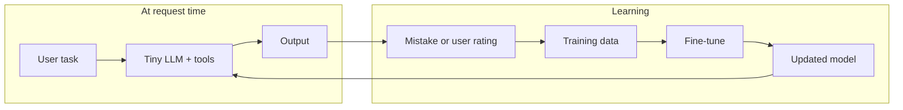

# Agent that recursively improves a small language model

## Goals: self-learning agent with a tiny LLM

- **Self-learning agent**: An agent that uses an **extremely small LLM** (millions of parameters, e.g. Phi-nano, SmolLM, TinyLlama) to solve tasks.
- **Custom code at request time**: The agent has access to **tools** (e.g. run code, fetch, search) so it can accomplish tasks by reasoning and acting, not only by generating text.
- **Learn from its own mistakes**: The system should **improve over time** by turning failed attempts and suboptimal outputs into training signal: when the agent fails to achieve the given output (or the user or an automatic checker says so), that run is used to generate correction data and the small model is fine-tuned so it does better next time.
- **User can interfere by rating**: The user **rates the agent’s performance** (good/bad + optional notes). Those ratings are included in the training data so the model aligns with what the user considers success.
- **Internet and browser access**: The agent can use the **internet** and a **browser** to find information that supports its decisions. It learns how to interact with the browser (navigate, read, click, type) so that browser actions become part of its learned behavior (see §6).
- **Architecture can be changed by the agent**: The agent can propose **changes to its own model architecture** (e.g. depth, width, pruning); the system supports training from that spec so the agent is not limited to fine-tuning a fixed architecture (see §5.2).
- **Multiple fine-tuned instances when necessary**: The agent can **spawn multiple fine-tuned instances** of the small LLM (e.g. for specialization, ensemble, A/B, or parallel capacity) and route tasks to the right instance(s) (see §2.3).
- **Tool-specific specialization and meta-optimization**: When the agent **creates a tool**, it can later get a **specialized model** for that tool (trained on trajectories involving the tool). The agent can **derive what to optimize** — prompt, model instance, or architecture — from feedback and runs, and the improvement pipeline branches accordingly (see §5.3).
- **Technique-aware and self-updating playbook**: The improvement agent **knows** techniques (LoRA, contrastive training, teacher distillation, etc.), their **application strategies** and **downsides** (§8–§9), and uses that knowledge to **pick the right one** per situation. It can **record and reuse its own insights** (what worked or failed in past runs) and optionally **update** the playbook so future runs benefit (see §10).
- **Agent-implemented database layers and RAG**: The agent (designed via chat) can **implement its own** database layers and RAG technologies — create and use custom storage (e.g. key-value, tables, or namespaced data) and custom retrieval (e.g. RAG collections, chunking, embedding config) so it is not limited to the app’s fixed schema or a single built-in RAG pipeline. We provide **tools** for creating/querying storage and for creating/ingesting/retrieving from RAG; the chat composes them so the designed agent can own its data and retrieval (see §2.0.2).
- **User-help interaction loop and secure credentials**: The agent can **request help from the user** when it needs credentials, 2FA, or other input (e.g. approval, choice). The app **notifies the user** when an agent needs help, and the user responds so the run can resume. Agent requests are **surfaced in the chat** so the user can see and respond there; **credentials are never shown in plain text** in the chat or history — only placeholders (e.g. "••••••••" or "[Saved as ref: …]") are displayed. Credentials are **persisted in a secure manner** (ref-based or encrypted vault, never raw secrets in the DB). An agent can **improve the security** of this (e.g. suggest rotation, scope restrictions, or record security insights) via tools and playbook (see §2.0.3).
- **User-definable guardrails via chat**: The user must be able to **define guardrails** with the help of the Agentron chat so they can **derisk security risks** (especially **prompt injection**) when the agent uses the internet (browser, fetch, etc.). Guardrails are created/updated via chat and applied at runtime when the agent calls internet-facing tools (see §2.0.4).

So the aim is a **self-improving system** that (1) runs the tiny LLM agent with tools (including browser) on real tasks, (2) collects mistakes and user ratings, (3) turns them into training data (trajectories, preferences, or corrected responses), (4) triggers fine-tuning or architecture-aware training (local or cloud), and (5) deploys the updated model for the next tasks — with the user able to steer via ratings at any time, and the agent able to use the web and to change its own architecture when beneficial.

### Design principle: implement via Agentron chat, not a fixed structure

The improvement system is **not** a single fixed agent or workflow hard-coded in the app. It is **implemented via the Agentron chat**: we provide **all the tools necessary** for improvement (data generation, evaluation, training trigger, technique playbook, **database layers**, **RAG**, **guardrails**, etc.), and the **user (or the chat) designs** the agent(s) and workflows by composing those tools. The chat already has `create_agent`, `create_workflow`, `update_workflow`, `create_tool`, `list_tools`, and so on; we add **improvement-specific tools** to the studio. Then, through conversation (e.g. “I want an agent that improves a small model from feedback”), the chat creates one or more agents and/or workflows, attaches the right tools, and configures system prompts and graph nodes. So the “improvement agent” is **whatever structure the user and chat design** — one agent with many tools, or a workflow with several agents each using a subset of tools. We do **not** prescribe a fixed graph; we **do** provide the full set of tools so the chat can design it.

---

## 1. Research summary: how recursive improvement works

### 1.1 Core approaches

| Approach | Idea | Data source | Fits orchestration? |
|----------|------|--------------|----------------------|
| **RISE** (Recursive Introspection) | Fine-tune so the model corrects its own mistakes over multiple turns; single-turn prompt becomes multi-turn MDP. | Self-distillation (sample multiple, pick best) or teacher distillation. | Yes: agent generates multi-turn (prompt, attempt, feedback, correction) data; external training runs the fine-tuning step. |
| **SPIN** (Self-Play Fine-Tuning) | Iterative: current model generates (question, response) pairs; train to distinguish self-generated vs human. | Model's own previous iteration + human reference. | Yes: agent runs "student" to generate pairs, optionally uses "teacher" for quality filter; training job runs SPIN-style loss elsewhere. |
| **Agent distillation** | Teacher LLM agent (with tools) produces trajectories; small model learns to imitate (with "first-thought" prefix). | Teacher trajectories (prompt + chain of thought + tool calls + results). | Yes: agent uses strong LLM + tools to generate trajectories; export as SFT or preference data; trigger training. |
| **ReST + ReAct** | Self-improvement for multi-step reasoning agents: iterative refinement (ReST) combined with agent trajectories (ReAct); two iterations of generate → filter → train can match much larger models on compositional QA. | Self-generated trajectories + filtering. | Yes: generate_training_data produces trajectories; filter (teacher or reward); trigger_training runs the cycle. |
| **Contrastive / multi-route verification** | Train on both **correct and incorrect** reasoning paths (e.g. ReaLM, Multi-Route Process Verification); guided chain-of-thought distillation encodes domain heuristics and improves generalization for small models. | Positive and negative traces. | Yes: from_feedback (bad + good) and failed runs yield contrastive pairs; generate_training_data can emit both for preference or contrastive loss. |
| **Modular autonomous pipeline** | Auto-generate curricula and isolate steps (planning, retrieval, distillation, SFT/DPO, evaluation) so each component can be swapped or scaled; ALAS-style pipelines improve accuracy with minimal human curation. | Mixed: scraped/distilled + human or judge. | Yes: our pipeline is already modular (generate → trigger → evaluate); keep planning/retrieval/distillation as separate tools or steps. |
| **Multiagent specialization** | Multiple independent specializations (different models on different self-generated data) preserve diverse reasoning and avoid **capability collapse** in long self-improvement runs. | Per-specialization data. | Yes: §2.3 multiple instances and §5.3 tool-specific specialization implement this. |
| **Stability-aware RLHF** | Entropy-gated KL regulation and PID-controlled thresholds (e.g. SAFE) reduce reward oscillations and policy crashes in on-policy LM-RLHF. | Preference or reward signal. | Backend: when using RL/RLHF, the **training backend** should support KL/entropy controls; our orchestrator only triggers training with dataset and optional config. |
| **Distillation-guided policy optimization (DGPO)** | Teacher demos and continuous guidance enable very small models (~0.5B) to learn agentic (e.g. RAG/search) behaviors and avoid sparse-reward cold starts. | Teacher trajectories + optional RL. | Yes: teacher-guided data generation (generate_training_data with teacher) then SFT/DPO fits this; RL step is optional and backend-dependent. |
| **Lightweight reward models** | Small bidirectional reward models (e.g. 400M, TinyRM with DoRA + layer freezing) can replace large reward models for preference scoring with lower inference cost. | Preference data. | Backend / evaluate_model: use a small reward model for scoring when doing RLHF or ranking; our evaluate_model can call a designated “reward” config. |

**Common loop:** generate data → (optional) filter/score → run training (external) → evaluate → repeat or stop.

Your stack has **no in-app training** (only inference via `callLLM`). So "recursive improvement" = an **orchestrator agent** that (1) generates or collects data, (2) runs evals, (3) **calls an external training service** (Replicate, Hugging Face AutoTrain, or **local** — see below), (4) tracks the "current" model, (5) iterates until a criterion is met.

### 1.2 Best practices (aligned with this plan)

- **Teacher-guided cold start**: Use demonstrations or distillation from a stronger model to **initialize** the small model before any RL or heavy self-play; avoids sparse-reward instability for compact models. Our **generate_training_data** with teacher strategy does this; run SFT on teacher trajectories first, then add feedback/self-play.
- **Iterative distillation + optional RL**: Combine self-distillation on generated trajectories with growing-batch RL or policy optimization; ReST-style: generate → filter → train → repeat. Our loop (generate → trigger_training → evaluate) supports this; backend can run SFT then DPO/RL.
- **Contrast positive and negative traces**: Train on both correct and incorrect paths; our **from_feedback** (good vs bad) and failed-run corrections provide contrastive signal. Extend **generate_training_data** to optionally emit negative traces (e.g. bad attempt + feedback) for contrastive or preference loss.
- **Modular pipeline**: Keep planning, retrieval, distillation, SFT/DPO, and evaluation as separate steps so components can be swapped or scaled. The **improvement tools** (generate_training_data, evaluate_model, trigger_training, decide_optimization_target, etc.) are separate tools the chat can attach to any agent or workflow in any order (§2.0).
- **Multiagent specialization**: Use multiple fine-tuned instances with different data/specializations to avoid single-agent collapse (§2.3, §5.3). Prefer **adding** instances and routing by task over repeatedly overwriting one model.
- **Stability-aware RL**: If the backend runs RLHF/PPO, prefer variants with KL and entropy control to avoid oscillations and policy collapse; pass through training config (e.g. max KL, entropy gate) from job or agent.
- **Lightweight reward models**: For preference or ranking, use a small reward model (e.g. 400M with DoRA) in **evaluate_model** or in the training backend to reduce cost and latency.

---

## 2. High-level architecture

### 2.0 Tools-first, chat-designed: no fixed improvement agent

We **do not** implement a single predefined “improvement agent” or “improvement workflow.” Instead we:

1. **Provide all improvement-related tools** (listed in §2.0.1) so that any agent or workflow can perform improvement by calling them.
2. **Let the chat design the agent**: The user describes what they want (e.g. “an agent that improves a small LLM from user feedback and runs training at night”); the chat uses **create_agent**, **create_workflow**, **update_workflow**, **list_tools**, etc., to create one or more agents and/or workflows that use those tools in the order and structure that fits the goal. The chat attaches the right tool IDs to the right nodes and writes system prompts (e.g. “First get technique knowledge, then decide optimization target, then generate data, then trigger training”).
3. **Keep improvement logic in the tools and in the LLM’s reasoning**: The tools are stateless building blocks (create job, generate data, trigger training, …); how often they are called, in what order, and under what conditions is determined by the **agent(s) or workflow(s) the user designed via chat**. So the “improvement agent” is whatever agent(s) or workflow(s) the user and chat compose from these tools.

**Training backends** (Replicate, Hugging Face AutoTrain, **local**) are unchanged; they are invoked by the **trigger_training** tool whenever an agent or workflow that uses it decides to run training.

#### 2.0.1 Canonical list of tools to provide (so the chat can design the agent)

Every capability below must be exposed as **studio tools** (so they appear in **list_tools** and can be attached to any agent via **create_agent** / **update_agent** with `toolIds`, or invoked from workflow nodes). The chat then composes them into whatever structure the user wants.

| Tool | Purpose | Used when the designed agent/workflow needs to |
|------|--------|-----------------------------------------------|
| **create_improvement_job** | Create an improvement job (student/teacher config, scope, optional architecture spec). | Start a new improvement run or track a new “model to improve.” |
| **get_improvement_job** / **list_improvement_jobs** | Read job(s) and their state (current model, instances, last trained, etc.). | Inspect or choose which job to work on. |
| **update_improvement_job** | Update job (e.g. current model ref, architecture spec, instance list). | After training completes or when the user changes scope. |
| **generate_training_data** | Produce dataset (teacher, from_feedback, self_play, contrastive, etc.); returns dataset ref. | Build data before training; agent chooses strategy from playbook + context. |
| **evaluate_model** | Run student (or a given instance) on eval set; return metrics. | Check if improvement is good enough or to compare instances. |
| **trigger_training** | Start a training run (dataset ref, backend, optional architecture spec, addInstance, etc.). | Kick off local or cloud training. |
| **get_training_status** | Poll training run; return status and output model ref when done. | Wait for training to finish, then update job. |
| **decide_optimization_target** | Given scope (job/agent/tool), return target (prompt \| model_instance \| architecture) and reason. | Let the designed agent branch: prompt vs train vs architecture. |
| **get_technique_knowledge** | Return technique playbook (and optionally recent insights for scope). | So the designed agent can “know” techniques and pick the right one. |
| **record_technique_insight** | Store outcome (helpful/harmful/neutral) and summary for a technique used in a run. | So future runs (or playbook updates) use observed results. |
| **propose_architecture** (or **update_architecture_spec**) | Attach an architecture spec to a job or next training run. | When the designed agent decides to change architecture. |
| **spawn_instance** (or **trigger_training** with addInstance) | Create a new model instance without replacing current; optionally tag (e.g. by tool). | Multiagent specialization, tool-specific model, A/B. |

Existing tools **create_tool**, **create_agent**, **create_workflow**, **update_workflow**, **list_tools**, **list_runs**, **get_run**, **execute_workflow**, etc. stay as-is; the chat uses them to **design** the improvement agent(s) and workflows and to wire the above tools into the right nodes. Optional: **browser** (real automation) and **run_code** / **http_request** for custom steps. No fixed structure: the chat designs it.

#### 2.0.2 Database and RAG tools (agent-implemented storage and retrieval)

The agent should be able to **implement its own** database layers and RAG technologies — not be limited to the app’s predefined schema or a single RAG pipeline. So we provide **tools** that the chat can attach to any agent; the designed agent then creates and uses custom storage and retrieval as needed (e.g. for trajectories, eval sets, technique insights, or domain documents). Every capability below is a **studio tool** so the chat can compose it into the agent(s) it designs.

**RAG (retrieval-augmented generation):**

| Tool | Purpose | Used when the designed agent needs to |
|------|--------|---------------------------------------|
| **create_rag_collection** (or **create_rag_collection** + link encoding/store) | Create a RAG collection (name, scope, encoding config, document store, vector store). | Set up agent-specific or job-specific retrieval (e.g. for improvement playbook docs, or for the small model’s context). |
| **list_rag_collections** / **get_rag_collection** | List or get collection(s) and their config. | Choose which collection to ingest into or query. |
| **ingest_rag** (or **add_documents_to_collection**) | Ingest documents (text or URLs) into a collection; chunk and embed per collection config. | Populate the agent’s own knowledge base (e.g. technique playbook, past trajectories, domain docs). |
| **retrieve_rag** (or **query_rag**) | Query a collection with a string; return top-k chunks (and optionally scores/sources). | Let the small model (or the improvement agent) augment context with retrieved content at run time. |
| **update_rag_collection** / **delete_rag_collection** | Change or remove a collection. | Adjust chunking, encoding, or scope when the agent’s design changes. |

**Database / custom storage:**

| Tool | Purpose | Used when the designed agent needs to |
|------|--------|---------------------------------------|
| **create_store** (or **create_agent_store** / **create_namespaced_store**) | Create a named store (e.g. key-value or table-like) scoped to an agent or job. | Give the agent its own persistence (e.g. for eval sets, run metadata, technique insights) without touching the app’s core schema. |
| **put_store** / **get_store** / **query_store** | Write, read, or query (e.g. by prefix or filter) entries in a store. | Store and retrieve structured data the agent defines (e.g. “eval_set_v1” → list of prompts; “last_run” → run id). |
| **delete_store** / **list_stores** | Remove a store or list stores for a scope. | Clean up or discover what storage the agent has created. |

If the app already has RAG APIs (e.g. [packages/ui/app/api/rag/](packages/ui/app/api/rag/)), these tools **wrap** those APIs so they appear in **list_tools** and can be attached to any agent. For “database layers,” either (a) add a simple **agent-scoped key-value or document store** (e.g. a table `agent_stores`: id, agentId, name, key, value or blob) and expose put/get/query/delete as tools, or (b) provide **run_code** (or a sandboxed SQL tool) with access to an agent-specific schema so the agent can define tables and run queries (heavier; (a) is simpler). The important point: **the agent implements its own DB and RAG by calling these tools**; the chat designs which agents have which tools and how they use them.

**Chat discoverability**: The improvement tools must appear in **list_tools** with clear descriptions (e.g. “Generate training data for model improvement; strategies: teacher, from_feedback, contrastive…”) so that when the user asks the chat to “build an agent that improves a small model” or “set up a workflow that retrains from feedback,” the chat can discover, attach, and compose these tools into the right structure. The chat assistant’s system prompt or tool docs should state that improvement is implemented by **composing** these tools into agents/workflows, not by a single built-in agent.

#### 2.0.3 User-help interaction loop and secure credentials

The agent must be able to **request help from the user** when it needs credentials, 2FA, approval, or other input. The app must **notify the user** when an agent is waiting, and **credentials must be persisted securely**. The agent (via tools and playbook) should be able to **improve the security** of credential and help-request handling.

- **Tool: request_user_help** (or extend ask_user for workflows): type (`credentials` | `two_fa` | `confirmation` | `choice` | `other`), message, optional schema. Run **pauses** (status waiting_for_user); request stored. User responds in UI → run **resumes** with that value.
- **Notify user**: Runs list/dashboard shows "Needs your input"; optional notification; **Pending requests** view with response UI (credentials: masked + "Save for future"; 2FA: code; confirmation: Approve/Deny; choice: options).
- **Surface agent requests via the chat**: Agent help requests (credentials, 2FA, confirmation, etc.) should be **surfaced in the chat** so the user can see and respond in the same place they normally interact. When a run enters waiting_for_user, the request appears in the chat as a **message or card** (e.g. in the conversation linked to that run, or in a dedicated "Agent requests" area in the chat UI). The request shows the agent/run context and the message (e.g. "Agent needs: API key for service X"); the user can **respond from the chat** (e.g. fill credentials in an inline form or click through to the full response UI). Resolving the request from chat resumes the run the same way as responding from the Pending requests view. So the user is not forced to leave the chat to handle agent requests.
- **Credentials anonymized in chat history**: When the user enters **credentials** (or other sensitive input such as 2FA codes), they must **never be displayed in plain text** in the chat or in history. (a) **Do not persist** the raw secret in conversation messages or in any UI-visible store. (b) **Do not echo** the credential back into the chat after submit — instead, store the value only in the secure ref/vault and show a **placeholder** in the chat, e.g. "••••••••" or "[Saved as ref: MY_API_KEY]" or "[Credential provided]". (c) In **chat history** (and when re-rendering past messages), any user message that was a credential (or 2FA) response must always render as that placeholder, never as the actual value. So credentials are anonymized everywhere in the chat: in the current turn, in history, and in any exports or logs that include chat content.
- **Secure credentials**: Persist only **refs** or **encrypted** vault; never raw secrets in DB. Ref-only (user sets env) or encrypted vault (encrypt at rest, resolve at runtime). Scope credentials per agent/workflow.
- **Agent improves security**: Tools **list_credential_refs**, **suggest_credential_rotation**, **update_credential_scope**, **record_security_insight**. Playbook (§10) includes security (refs vs vault, rotation, least privilege). Agent can suggest or apply better practices.

#### 2.0.4 Guardrails (user-defined via chat, prompt-injection derisking)

The user must be able to **define guardrails** with the help of the Agentron chat so they can **derisk security risks** — especially **prompt injection** — when the agent does things on the internet (browser, fetch, HTTP, etc.). Untrusted content from the web can contain instructions or payloads aimed at the model; guardrails limit what the agent can do and how remote content is passed to the model.

**1. User defines guardrails via chat**

- **Tools** (so the chat can create/update guardrails on behalf of the user): **create_guardrail**, **list_guardrails**, **get_guardrail**, **update_guardrail**, **delete_guardrail**. The user says e.g. “Only allow the agent to visit these domains” or “Strip script tags and obvious instructions from web content before the model sees it”; the chat calls create_guardrail (or update_guardrail) with the right config. Guardrails are stored per **scope** (e.g. deployment-wide, per agent, or per workflow) so the user can have different rules for different agents.
- **Guardrail config** (what the user can define, with chat help): (a) **Allow/deny list for internet**: allowed domains or URL patterns for fetch/browser; block everything else or allow-by-default with deny list. (b) **Content sanitization for remote content**: before text from a fetched page or browser snapshot is given to the model, apply rules — e.g. strip HTML/script, remove lines that look like system prompts or “ignore previous instructions,” cap length, or run a simple filter (blocklist of phrases). (c) **Segmentation**: treat remote content in a dedicated block (e.g. “Remote content (untrusted): …”) so the model and the system can separate it from the user’s trusted message. (d) **Tool-level restrictions**: e.g. “browser allowed only on these domains”; “fetch max 5 requests per run.” (e) **Optional: per-agent or per-workflow overrides** so the user can tighten or loosen guardrails for specific agents.

**2. Runtime: apply guardrails when the agent uses the internet**

- When the agent calls **fetch**, **browser** (navigate/snapshot), or other **internet-facing tools**, the runtime **applies** the guardrails for that run’s scope (agent/workflow/deployment): (a) **Before** the tool runs: if URL/domain is not allowed, block the call and return an error (or a safe message) to the agent. (b) **After** the tool runs: if the tool returns remote content (e.g. page body or snapshot), **sanitize** it per guardrail config (strip markup, filter obvious injection patterns, cap size) and **segment** it (e.g. wrap in “Remote content (untrusted): …”) before appending it to the conversation or context the model sees. (c) Enforce **rate/scope limits** (max requests, allowed domains). So prompt-injection risk from the internet is reduced by **restricting where the agent can go** and **how untrusted content is presented** to the model.

**3. Chat helps the user define and tune guardrails**

- The chat can **suggest** guardrails (e.g. “For an agent that browses the web, I recommend an allow-list of domains and sanitization of remote content”) and **create or update** them via the tools. The user can say “I want to limit prompt injection when my agent uses the browser”; the chat creates a guardrail (e.g. allow-list empty until the user adds domains, plus “sanitize remote content and segment it”) and attaches it to the relevant agent or deployment. The user can refine over time (“add example.com to the allow list,” “block any page that contains the word …”) via chat.

**Summary**

| Requirement | Implementation |
|-------------|----------------|
| User defines guardrails via chat | Tools **create_guardrail**, **list_guardrails**, **get_guardrail**, **update_guardrail**, **delete_guardrail**; guardrail config (allow/deny domains, sanitization rules, segmentation, tool limits). Scope: deployment, agent, or workflow. |
| Derisk prompt injection on internet | Runtime applies guardrails when agent uses fetch/browser/HTTP: block disallowed URLs; sanitize remote content (strip markup, filter injection-like patterns, cap length); segment untrusted content before it reaches the model. |
| Chat helps | Chat suggests and creates/updates guardrails from natural language (“only these domains,” “strip scripts and instructions from web pages”); user refines via conversation. |

### 2.1 Self-learning loop (task → mistake → train → repeat)

1. **At request time**: User gives a task → the **tiny LLM** (current version) runs with **tools** (e.g. run code, fetch) and produces an output.
2. **Mistake / rating**: The output is wrong, or the user rates it bad (or good). Optionally an automatic checker (e.g. unit test, expected format) marks success/failure.
3. **Training data**: Failed or low-rated runs are converted into training data: **trajectories** (prompt + model’s tool calls + tool results + final answer, or prompt → bad attempt → feedback → correction). User ratings become preference pairs or SFT targets (see §4).
4. **Fine-tune**: Trigger training (local or cloud) on that data; get an **updated model**.
5. **Next task**: The agent uses the updated model; the cycle repeats so the system **learns from its own mistakes** and from **user ratings**.

Because the agent uses **custom code at request time**, the training data should include **full trajectories** (reasoning + tool calls + results), not only final text, so the small model learns *when and how* to call tools to achieve the given output.

---

## 2.2 Asynchronous human feedback

**Yes — human feedback can be incorporated asynchronously.** The user does not need to rate in the same session or block the agent.

- **When feedback arrives**: Whenever the user rates a run (good/bad + notes), store it in the [feedback](packages/core/src/db/schema.ts) table with the appropriate `targetType` and `targetId` (e.g. the student agent id or the improvement job id). No need to wait for a training run.
- **When it is used**: The improvement loop runs **on a schedule** (e.g. nightly) or **on-demand** (e.g. “Retrain with new feedback”). Each run calls **generate_training_data(strategy: "from_feedback", scope, since?: timestamp)** and pulls **all feedback** for that scope since the last training run (or since job creation). So feedback given minutes or days later is included in the next training iteration.
- **Implementation**: Store a “last training data snapshot” time (or last run id) per job; when generating data, query feedback where `createdAt > lastUsed` (and optionally cap to a maximum batch size). After training, update `lastUsed`. Optionally expose “Include feedback since …” in the UI so the user can see what will be pulled.

So the flow is: user rates runs at any time → feedback is persisted → next improvement run gathers new feedback asynchronously and incorporates it into training data. No synchronous “wait for rating” step is required.

### 2.3 Multiple fine-tuned instances (spawn when necessary)

**Yes — the agent can spawn multiple fine-tuned instances of the small LLM when necessary.** The system is not limited to a single “current” model per job; it can maintain a **pool of instances** (different checkpoints, different fine-tunes, or different specializations) and use them in parallel or by task.

- **When it’s useful**: (1) **Specialization**: Different instances fine-tuned on different data (e.g. one for “code”, one for “search/browser”) so the orchestrator routes subtasks to the right instance. (2) **Ensemble**: Run several instances on the same task and combine outputs (e.g. majority vote, or a meta-model chooses the best). (3) **A/B or rollback**: Keep a previous instance while testing a new one; roll back if the new one underperforms. (4) **Parallel capacity**: Multiple instances (same or different weights) to handle concurrent requests without blocking.
- **What the system must support**: (1) **Trigger training** can produce a **new instance** without replacing the “current” one — e.g. `trigger_training(..., addInstance: true)` or a separate tool **spawn_instance** that runs training (from current or from a chosen checkpoint/data) and registers the result as a new model ref. (2) **Job (or “model pool”)** tracks **multiple model refs** (e.g. `instanceIds[]` or a table of instances with ref, createdAt, optional tags like "code" / "browser"). (3) **At request time**, the runtime can **route** to a specific instance: the agent (or the orchestrator) chooses which instance to use per task (e.g. by tool **select_instance** or by passing `llmConfigId` / `instanceId` that points to one of the fine-tuned instances). Existing [LLM configs](packages/core/src/types/llm.ts) already allow multiple configs (e.g. different models/endpoints); each fine-tuned instance is just another config (or an alias) pointing at that instance’s endpoint or path.
- **Implementation**: (a) Improvement job stores a **list of instance refs** (not only “current”); **trigger_training** appends a new ref when training completes, unless explicitly “replace”. (b) Optionally the agent has **spawn_instance** (or **trigger_training** with a flag) to “create a new instance from this data/spec” and optionally tag it (e.g. for specialization). (c) When running the tiny-LM agent, the executor receives which instance to use (e.g. from workflow context, or from an orchestrator that picked an instance); **callLLM** uses the LLM config that points at that instance. (d) For ensemble, the workflow can run multiple agent steps (one per instance) and then a small combiner step.

So: **the agent can spawn multiple fine-tuned instances when necessary**; the improvement pipeline and job model support multiple instances; routing and selection (by task, by tag, or by orchestrator) determine which instance(s) run for a given request.

---

## 3. Local fine-tuning alternative

**Yes — fine-tuning can be done locally** as a first-class alternative to Replicate or Hugging Face. The agent would trigger and poll a **local** training process instead of a cloud API.

### 3.1 What “local” means

- **Same machine** as the Studio app (or a machine the app can reach via HTTP).
- A **training process** that:
  - Reads the dataset produced by the agent (e.g. JSONL from `.data/improvement/<jobId>/<iter>.jsonl` or a path you pass).
  - Runs SFT / RISE / SPIN-style training (e.g. with Hugging Face Transformers, Axolotl, or Unsloth) on the small model.
  - Writes the fine-tuned model somewhere the app (or Ollama/vLLM) can load it: e.g. a new directory under `.data/models/`, or an Ollama Modelfile, or a vLLM-friendly path.
- The app **does not** run the training code itself (no Python/GPU inside Node). It only **invokes** the local trainer and **polls** until done.

### 3.2 How the agent triggers local training

Two practical options:

1. **Local HTTP server (recommended)**  
   - You run a small service (e.g. FastAPI/Flask) that:
     - `POST /train`: accepts job id, dataset path (or ref), base model id/path, hyperparams; starts training in a subprocess or background thread; returns `run_id`.
     - `GET /train/<run_id>`: returns status (pending / running / completed / failed) and, when completed, the path or id of the output model.
   - The improvement tool **trigger_training** with `backend: "local"` does `httpRequest` to `http://localhost:<port>/train` (or a configurable URL). **get_training_status** polls `GET /train/<run_id>`.
   - Pros: same interface as Replicate/HF (trigger → poll → get model ref); works from workflows and chat; no need to expose the host’s shell.

2. **Script or CLI**  
   - A script (e.g. `python train.py --job-id ... --dataset ... --base-model ...`) that runs training and, when done, writes the output model path to a file or DB the app can read.
   - The app could start it via `child_process.spawn` (new API route or Node tool) or via a **runCode** call to an endpoint that runs the script (if you have such an endpoint). Polling would be implemented by the app (e.g. checking a status file or a small DB table the script updates).
   - Pros: no extra server; cons: more app logic for process lifecycle and polling, and runCode’s 60s timeout is too short for training — so “trigger” must be fire-and-forget and polling must be separate.

**Recommendation:** Implement **local** in the plan as “local HTTP trainer”: one configurable base URL (e.g. `http://localhost:8765` or from env `LOCAL_TRAINER_URL`). The improvement tools already support `backend: "local"`; they just need to call that URL for trigger and status, and to pass dataset path and base model ref that the local server understands (e.g. local path or HF model id the server can download).

### 3.3 What the local trainer needs

- **Inputs**: Dataset path (or inline JSONL), base model (Hugging Face id or local path), optional hyperparameters (epochs, lr, batch size). Optionally: training mode (full fine-tune vs **LoRA/DoRA**), architecture spec (for train-from-spec).
- **Output**: New model path or id (e.g. `./.data/models/improved-<jobId>-<iter>` or an Ollama model name). The app then updates the improvement job’s “current model” so the next eval and/or next iteration use this model (e.g. by pointing the student LLM config at a new Ollama model or a vLLM endpoint that loads that path).
- **GPU**: Optional but typical for non-tiny models; the local server would use CUDA if available. The app stays GPU-agnostic.
- **Efficiency (from literature)**: Prefer **LoRA or DoRA** for fine-tuning to reduce tunable parameters and memory (§9.1); optionally support **quantization** (e.g. sparse ternary) of the output model for edge or low-memory deployment (§9.2).

### 3.4 Summary

- **Yes, fine-tuning can be done locally** as an alternative to Replicate/HF.
- **Preferred pattern**: Local HTTP trainer (trigger + status + output model path); improvement tools call it when `backend: "local"` and URL is configured.
- **Optional pattern**: Fire-and-forget script + app-side polling (status file or DB), if you prefer not to run a dedicated trainer service.

The rest of the plan (data generation, evaluation, job model, tools, workflow loop) is unchanged; only the **trigger_training** / **get_training_status** implementation gains a **local** backend that talks to this local trainer.

---

## 4. Including user feedback (user rates the agent’s performance)

The user **rates the agent’s performance** on real task runs (good/bad + optional notes). That rating is the main human signal for the self-learning loop: it identifies which outputs to learn from (good as targets, bad as “avoid” or as failed attempts to correct). User feedback can be used in three ways: (1) as the **source of training data**, (2) as a **filter** for synthetic data, and (3) as **in-loop guidance** during improvement runs.

### 4.1 Existing feedback in the app

The app already has a [Feedback](packages/core/src/types/feedback.ts) type: `targetType` (agent | chat), `targetId`, `executionId`, `input`, `output`, `label` (good | bad), optional `notes`, `createdAt`. It is stored in the [feedback](packages/core/src/db/schema.ts) table and used today by the [prompt-refiner](packages/runtime/src/agent/prompt-refiner.ts) to suggest prompt changes. The same records can be reused for **improvement** training data.

### 4.2 Feedback as training data

- **Preference / DPO-style**: For a given `input`, use feedback rows with the same (or similar) input: one `label: "good"` → chosen response, one `label: "bad"` → rejected response. Export as preference pairs `(prompt, chosen, rejected)` for DPO/ORPO training. If there are multiple good/bad for the same input, pick or aggregate (e.g. random pair, or best vs worst by notes).
- **SFT-style**: Use only `label: "good"` rows as `(input, output)` SFT pairs. If the user left `notes` (e.g. “should be shorter”, “fix the number”), you can either (a) treat `output` as the target, or (b) call the teacher with `(input, output, notes)` to produce a “corrected” response and use that as the SFT target.
- **RISE-style**: Use `label: "bad"` rows as failed attempts; optionally use `notes` as environment feedback. Generate a correction (teacher or next-turn) and store as multi-turn (prompt → bad attempt → feedback → correction) for RISE-style fine-tuning.
- **Contrastive (positive + negative traces)**: For better generalization, train on both correct and incorrect paths (literature: ReaLM, Multi-Route Process Verification). **generate_training_data** should be able to emit **negative** examples (e.g. bad attempt + feedback) alongside positive (good output or corrected output) so the backend can use contrastive or preference loss (DPO/ORPO).

So **generate_training_data** should support a strategy like **from_feedback** that:

- Takes a **scope**: which feedback to use. Options: (a) `targetType + targetId` (e.g. a specific agent or chat), (b) `executionId` (a specific run), or (c) **improvement-job-specific** feedback (see below).
- Optionally **filters** by time range or minimum count.
- **Converts** to the format the training backend expects (JSONL for SFT or preference).
- Returns a dataset ref (path or id) and a short summary (e.g. “42 SFT pairs from 38 feedback rows”).

This way the improvement agent can “include user feedback” by calling **generate_training_data(strategy: "from_feedback", scope: { targetType, targetId })** and then using that dataset (alone or mixed with synthetic data) in **trigger_training**.

### 4.3 Feedback as filter for synthetic data

When generating data with the **teacher** (or self-play), you can **score** candidate (prompt, response) pairs with a user-preference signal:

- If the user has given feedback on similar prompts before, use a small classifier or the teacher to predict “would the user rate this good or bad?” and keep only “good” or above-threshold.
- Or: show a **sample** of generated pairs in the UI and let the user approve/reject; store those as feedback and use only approved ones in the next **generate_training_data** run.

So “include user feedback” here means: **filter** synthetic data so the training set aligns with past (or current) user preferences.

### 4.4 In-loop feedback (improvement-job-specific)

During an improvement run, the user may want to rate **eval outputs** or **sample model outputs** and have that feed the **next** iteration:

- **Option A – Reuse existing feedback**: Associate feedback with the agent or chat that is the “student” in the improvement job. When generating the next batch, **generate_training_data(from_feedback, scope: { targetId: studentAgentId })** pulls in new feedback since last run.
- **Option B – Job-scoped feedback**: Introduce improvement-job-scoped feedback so the UI can show “eval sample” or “model sample” and the user marks good/bad/notes. Store with `targetType: "improvement_job"` and `targetId: jobId`. **generate_training_data(from_feedback, scope: { jobId })** reads only that job’s feedback.

For Option B you only need to (a) allow `targetType: "improvement_job"` in the feedback table (and in the Feedback type), and (b) add a small UI to attach feedback to a job (e.g. “Rate this response” on an eval or sample output). No new table is strictly necessary if the schema allows a generic targetType.

### 4.5 Summary

| Use of feedback | How |
|-----------------|-----|
| **As training data** | **generate_training_data(strategy: "from_feedback", scope)** reads from the feedback table, converts to SFT or preference JSONL, returns dataset ref. |
| **As filter** | When generating synthetic data, score or filter candidates using past feedback (or a quick user approval step) so only preferred-style data is kept. |
| **In-loop** | Let users rate eval/sample outputs; store as feedback linked to the improvement job (or to the student agent); next iteration’s **generate_training_data** includes this new feedback. |

Implementing **from_feedback** in **generate_training_data** and (optionally) job-scoped feedback in the schema/UI gives you a clear way to **include user feedback** in recursive SLM improvement.

---

## 5. Agent-coded tools and model architecture

### 5.1 Can the agent code its own tools?

**Yes.** The app already exposes [create_tool](packages/runtime/src/chat/tools/tool-tools.ts) (and update_tool, list_tools, get_tool) to the assistant. So any agent that has these tools can create and update tools.

- **Today**: The assistant (and workflows that use it) can create **HTTP** tools (URL + method), **MCP** tools (server config), and **native** tools (built-in by id). The agent cannot yet define a *new* tool by supplying executable code (e.g. a Python snippet) that is stored and run when the tool is invoked.
- **To let the agent “code” its own tools**: (a) Give the self-learning agent (or the tiny-LM agent, if it is the one that designs tools) access to **create_tool** and **list_tools** / **get_tool**. (b) Extend tool creation so the agent can define a **code-backed** tool: e.g. a new protocol `"code"` or a native wrapper where `config` holds a code snippet (and optionally language); at execution time the runtime runs that snippet via the existing run-code path (or a sandboxed executor) with the tool’s input as the snippet’s input. Then the agent can create tools by specifying name, description, input schema, and code; those tools become part of the agent’s tool set for the next runs and can be included in trajectories for training.

So: **agent-coded tools** = agent calls create_tool (and optionally update_tool) to add or change tools; with a small extension (code-as-config and execution at invoke time), the agent can define tools by writing code, and the system can learn from tool-augmented trajectories that include those new tools.

### 5.2 The agent can change the architecture of its model (in scope)

**Yes — the agent can change its own model architecture.** This is part of the design, not a later add-on. The agent is not limited to fine-tuning a fixed architecture; it can propose **architecture changes** (e.g. depth, width, pruning, MoE) and the system will build and/or train a model from that spec when beneficial.

- **What the agent can do**: Propose an **architecture spec** (e.g. “reduce to 4 layers”, “prune 20% of attention heads”, “increase hidden size to X”). The agent does this via a dedicated capability: e.g. a tool **propose_architecture** (or **update_architecture_spec**) that accepts a structured spec (layers, hidden_size, attention_heads, etc.) and attaches it to the improvement job or the next training run. The agent can call this when it (or the orchestrator) infers that the current architecture is a bottleneck (e.g. from eval metrics or failure modes).
- **What the system must do**: (1) **Training/build backend** must support **train-from-spec**: given an architecture spec (e.g. Hugging Face config + overrides, or a small DSL), build or modify the model graph and run training (from scratch or from a pretrained base), not only SFT on a fixed arch. (2) **Improvement job** can carry an optional **architecture_spec**; when present, **trigger_training** passes it to the backend so the next model is built from that spec. (3) **Safety and cost**: architecture search can be expensive and risky; make it configurable (e.g. allow-list of allowed changes, max compute per run, or an explicit user approval step for first use).
- **Implementation**: Include **propose_architecture** (or equivalent) in the improvement agent’s tools. When the agent calls it, store the spec on the job; **trigger_training** sends the spec to Replicate / HF / local trainer. The local trainer (and, where supported, cloud APIs) must accept an optional architecture spec and run a “build + train” pipeline when provided, instead of only fine-tuning the current checkpoint. Trajectories that lead to good outcomes after an architecture change can be used to train the *next* model (same or updated arch).

So: **architecture change is in scope**. The agent can propose architecture changes; the improvement pipeline and training backends support train-from-spec; the agent can thus evolve both its weights and its architecture over time.

### 5.3 Tool-specific specialization and deciding what to optimize

When the agent **creates a tool**, that tool may need a **specialized model** — a fine-tuned instance trained mainly on trajectories that involve that tool. The agent should be able to **provide that learning experience** (collect signal around the tool) and **derive what to optimize**: prompt only, model instance, or architecture.

#### 5.3.1 Per-tool learning and specialized instances

- **Signal per tool**: For each tool (especially agent-created ones), the system can track:
  - **Feedback** attached to runs where that tool was used (good/bad + notes from the user).
  - **Success/failure** of tool use (e.g. did the overall task succeed? did a checker or test pass?).
  - Optional: latency, cost, or error rates.
- **Specialized model for a tool**: If the agent (or the improvement loop) infers that the tool would benefit from a dedicated model:
  - **Generate training data** from trajectories that **involve that tool only** (or that tool + its subtask type).
  - **Trigger training** to produce a **new instance** (see §2.3); tag it as belonging to that tool (e.g. `toolId` or `scope: "tool:<id>"`).
  - **Bind the instance to the tool**: The tool’s config (or the runtime’s tool-execution path) can carry an optional **llmConfigId** (or **instanceId**) so that when the agent uses this tool, the “reasoning” that decides how to call it — or a dedicated sub-agent that operates the tool — uses this specialized model instead of the default. So: agent creates tool → over time, system can spawn a **specialized model instance** for that tool and attach it via config.
- **Data model**: Store per-tool learning state: e.g. `toolId → { optionalLlmConfigId?, feedbackCount, lastTrainedAt?, metrics? }`. When generating data for “specialized instance for tool X”, filter trajectories by “tool X was used” and optionally by feedback label.

#### 5.3.2 Meta-decision: what to optimize (prompt vs model vs architecture)

The agent (improvement agent or orchestrator) should be able to **derive what to optimize** from the available signal — prompt, model (or model instance), or architecture — instead of always doing the same thing.

- **Tool: decide_optimization_target** (or equivalent):  
  - **Input**: Scope (e.g. `agentId`, `toolId`, `jobId`), optional time range.  
  - **Behavior**: Reads recent runs, feedback, and metrics for that scope. Classifies the failure/success pattern (e.g. “wrong instructions” vs “lacks capability” vs “architecture bottleneck”).  
  - **Output**: A structured decision, e.g.  
    `{ target: "prompt" | "model_instance" | "architecture", scope: "tool" | "agent" | "global", reason: string, optionalSpec?: ... }`  
  - So the agent explicitly **decides** whether to tweak the prompt, spawn or update a model instance, or propose an architecture change.
- **Branching in the improvement workflow**: After **decide_optimization_target** (or when the agent interprets feedback), the improvement loop branches:
  - **target = "prompt"**: Call existing **prompt-refiner** (or a tool that updates the agent’s/tool’s system prompt or graph); then **update_tool** / **update_agent** to persist. No training run.
  - **target = "model_instance"**: Call **generate_training_data** (scope = agent or tool), then **trigger_training** (optionally **addInstance: true** or **spawn_instance**); if scope is a tool, tag the new instance for that tool and bind it (set tool’s optional **llmConfigId**).
  - **target = "architecture"**: Call **propose_architecture** with a spec, then **trigger_training** with that spec (train-from-spec path).
  - **target = "none"** or “not enough signal”: Skip or wait for more data.
- **Who drives it**: Whatever agent or workflow the user designed via chat (e.g. one that has decide_optimization_target and the other improvement tools) can call **decide_optimization_target** periodically or after N new feedback items; then it executes the chosen branch by calling the other tools. So the **designed** agent provides the learning experience and derives what to optimize; no fixed “improvement agent” is required.

#### 5.3.3 Summary

| Concept | Implementation |
|--------|-----------------|
| **Tool needs specialized model** | Generate training data from trajectories that use that tool; trigger_training → new instance; bind instance to tool via tool config (e.g. optional llmConfigId). |
| **Per-tool learning** | Track feedback and metrics per tool; store optional specialized instance ref and last-trained state per tool. |
| **Decide what to optimize** | Tool **decide_optimization_target(scope)** → returns `target` (prompt \| model_instance \| architecture) and `scope`; improvement workflow branches to prompt-refiner + update_tool/agent, trigger_training (instance or from-spec), or propose_architecture. |
| **Agent provides learning experience** | Feedback and runs are the signal; the agent (via decide_optimization_target and the improvement tools) derives whether to optimize prompt, model, or architecture and triggers the right action. |

So: when the agent **creates a tool**, the system can later **spawn a specialized model** for that tool and bind it; and the agent can **derive what to optimize** (prompt, model instance, or architecture) and the improvement pipeline branches accordingly.

---

## 6. Internet and browser access (learn to interact with the browser)

The agent **has internet access** and can use a **browser** to find information that supports its decisions. Crucially, it should **learn how to interact with the browser** — when to navigate, what to click, how to read the page — so that browser use becomes part of its learned behavior, not only a fixed “fetch URL” call.

### 6.1 What “internet access” and “browser” mean here

- **Internet access**: The agent can reach the web (e.g. fetch URLs, call APIs, load pages). Today the app provides [std-fetch-url](packages/runtime/src/tools/builtins.ts) and **std-browser** (currently implemented as the same as fetch: HTTP GET and return body text). So the agent can already pull content from a URL.
- **Real browser interaction**: To “learn how to interact with the browser”, the agent needs **real browser automation**: navigate to a URL, get a **DOM snapshot** (structure and text), **click** elements, **type** into inputs, **scroll**, etc. That way the agent can learn *sequences* of actions (e.g. open search → type query → click result → read article) and those sequences become part of its trajectories. Today **std-browser** is fetch-only; it does not expose navigate/snapshot/click/type.

### 6.2 What to add so the agent can learn browser interaction

- **Browser tool with real automation**: Expose a browser capability that supports at least: **navigate(url)**, **snapshot** (return page structure / accessible text for the model), **click(ref or selector)**, **type(ref or selector, text)**. Options: (a) Integrate an MCP server that provides browser automation (e.g. cursor-ide-browser style: lock tab, navigate, snapshot, click, type, unlock). (b) Add a native or HTTP tool that talks to a Playwright/Puppeteer (or similar) service so workflows and the tiny-LM agent can call it. The tool’s **outputs** (e.g. snapshot content, navigation result) must be in a form the model can reason about (text or structured summary).
- **Browser actions in trajectories**: When the agent uses the browser tool, each call (navigate, snapshot, click, type) and its result must be **logged in the run** and included in **training data** as part of the trajectory. So the small model is trained on sequences like: task → [navigate to X] → [snapshot: …] → [click search box] → [type “query”] → [snapshot: results] → … → final answer. That is how the agent “learns” when and how to use the browser to find supporting information.
- **Safety**: Browser use can hit arbitrary URLs and submit forms. Apply the same safety and sandboxing as for other tools (e.g. allow-list of domains, or user-approved “browser allowed” per agent/job, and optional headless/isolated profile to limit side effects).

### 6.3 Summary

| Requirement | Approach |
|-------------|----------|
| **Internet access** | Already available via std-fetch-url / std-browser (fetch). Keep and ensure the self-learning agent has these tools. |
| **Learn to interact with the browser** | Add (or integrate) a **real browser automation** tool (navigate, snapshot, click, type). Include browser actions and their results in **trajectories** so the small model learns how to use the browser to support its decisions. |
| **Support decisions** | Trajectories that include browser steps + final answer are used for SFT/preference/RISE-style training; the model learns to use the browser when it helps achieve the task. |

So: the agent **can have internet access** and **use a browser**; to support **learning how to interact with it**, the system must expose real browser automation (not only fetch) and record those interactions in trajectories for training.

---

## 7. Trajectory tracking in the UI (implementation plan)

The user must be able to **see trajectories** (run → execution trail) and **attach feedback** from the UI so that trajectory data and ratings flow into the improvement pipeline (generate_training_data from_feedback, trajectory export). This section is an implementation plan for trajectory tracking by the user in the UI.

### 7.1 What “trajectory” is and where it lives today

- **Trajectory** = the sequence of steps that produced a run’s output: for workflows, the **execution trail** (one step per agent node: `nodeId`, `agentId`, `agentName`, `order`, `round?`, `input`, `output`, `error`). Each step is one agent invocation (input in, output out). The inner **LLM + tool-call loop** inside a node (multiple tool rounds) is **not** persisted today — only the final string output of the node is in the step.
- **Where it lives**: Run record in `executions` table; `output` is JSON containing `output.output` (final result) and `output.trail` (array of steps). [run-workflow](packages/ui/app/api/_lib/run-workflow.ts) builds the trail and passes it to `onStepComplete`; the run is updated via PATCH with `executionOutputSuccess(output, trail)`. So trajectory = run + `output.trail`.
- **Existing UI**: [Runs list](packages/ui/app/runs/page.tsx) shows all runs (no filter). [Run detail](packages/ui/app/runs/[id]/page.tsx) shows status, output, and **Execution trail** (expandable cards per step via `TrailStepCard`), plus “Copy for chat” / “Open in chat”. There is **no** “Rate this run” or “Rate this step” on the run page; feedback exists for **chat** (message-level) and for **agents** (agent feedback panel by `targetId`), and feedback can store `executionId` (run id).

### 7.2 Goals for trajectory tracking in the UI

1. **View**: User can open any run and see the full **trail** (existing). Optionally, per-step show more detail if we persist inner tool calls (see below).
2. **Filter and find**: User can **list/filter runs** by target (workflow, agent), by time, and optionally by improvement job or “used for training” so they can focus on runs that matter for learning.
3. **Feedback from trajectory**: User can **rate a run** or **rate a step** from the run detail page. Submitting feedback creates a Feedback row with `executionId = run.id` and appropriate `targetType`/`targetId`; optionally a **step reference** (e.g. step index or step id) so `generate_training_data(from_feedback)` can associate feedback with a specific step for step-level SFT/preference.
4. **Improvement pipeline link**: Feedback attached to runs/steps is the same data that **generate_training_data(strategy: "from_feedback", scope)** reads. So “trajectory tracking” in the UI = making runs and trail visible and making it easy to attach feedback from that view, so the user’s ratings drive what gets optimized.

### 7.3 Data and API

| Need | Approach |
|------|----------|
| **Richer trajectory (optional)** | For full training value, a trail step can optionally include **inner** structure: e.g. `messages` (or `toolCalls`/`toolResults`) for the LLM+tool loop inside that node. Extend [ExecutionTraceStep](packages/ui/app/api/_lib/run-workflow.ts) and the payload in `run-workflow` so that when the executor returns, we can persist a step with optional `subSteps` or `toolCalls`. NodeAgentExecutor would need to return or expose that (today it does not). Phase 2 after run-level feedback works. |
| **Feedback for a run** | POST to existing (or new) feedback API with `targetType` (e.g. `"workflow"` or `"agent"`), `targetId` (workflow id or agent id), `executionId: run.id`, `input` = run context (e.g. workflow input or first step input), `output` = run output or summary, `label`, `notes`. So “Rate this run” creates one feedback row per run. |
| **Feedback for a step** | Option A: Same feedback table, add optional `stepIndex?: number` (and `executionId`). So one row = one step rating; `input`/`output` = step input/output. Option B: Keep only run-level feedback for v1; step-level can be “notes” that describe which step was good/bad. Prefer Option A if we want step-level preference data. |
| **List runs with filters** | Extend GET [packages/ui/app/api/runs/route.ts](packages/ui/app/api/runs/route.ts) to accept query params: `targetType`, `targetId`, `limit`, optional `improvementJobId` (when jobs exist). Return runs that match so the UI can show “Runs for this workflow” or “Runs for this improvement job”. |

### 7.4 UI implementation

| Component | Change |
|-----------|--------|
| **Run detail page** [packages/ui/app/runs/[id]/page.tsx](packages/ui/app/runs/[id]/page.tsx) | Add a **“Rate this run”** block: buttons or toggle for Good / Bad, optional notes field, Submit. On submit, POST feedback with `executionId: run.id`, `targetType`/`targetId` from run, `input` = run’s initial input or first step input, `output` = run’s final output. Optionally show “You rated this run: good/bad” if feedback for this `executionId` already exists. |
| **Trail step card** | Add **“Rate this step”** (Good / Bad + notes) per step. POST feedback with `executionId: run.id`, optional `stepIndex: step.order` (or step id if we add it), `input` = step.input, `output` = step.output, `targetType`/`targetId` from run. Requires API to accept step ref (see above). |
| **Runs list** [packages/ui/app/runs/page.tsx](packages/ui/app/runs/page.tsx) | Add **filters**: dropdown or tabs for “All / Workflows / Agents”, optional “Workflow” or “Agent” selector (when filtered), optional time range or “Last N”. Call GET /api/runs?targetType=workflow&targetId=... when user selects. Optionally show a badge “Rated” or “Used in training” when feedback exists for that run or when run id is in a training dataset (phase 2). |
| **Improvement job view** (when jobs exist) | On the improvement job detail page, show **“Runs for this job”** (runs where targetId = student agent or where run id is linked to the job). List runs with links to run detail; user can open and rate. Alternatively, “Runs” page gets a filter “Improvement job: X”. |

### 7.5 Implementation order

1. **Feedback from run detail (run-level)**  
   - API: Ensure POST /api/feedback accepts `executionId` and stores it (already in schema). Payload: targetType, targetId, executionId, input, output, label, notes.  
   - UI: On run detail page, add “Rate this run” (Good / Bad, notes, Submit). Load existing feedback for this run (GET feedback?executionId=runId) to show current rating if any.

2. **Runs list filters**  
   - API: GET /api/runs?targetType=&targetId=&limit= (optional). Filter executions by targetType/targetId, limit default 50.  
   - UI: Runs page add filter controls; fetch with query params; optional “View runs for this workflow” link from workflow detail.

3. **Step-level feedback (optional)**  
   - API: Add optional `stepIndex` (or `stepId`) to feedback schema and POST. When generating training data, from_feedback can group by stepIndex for step-level pairs.  
   - UI: On each TrailStepCard, add “Rate this step” (Good / Bad, notes). Submit with executionId + stepIndex + step input/output.

4. **Richer trail (optional, for training)**  
   - Runtime: In run-workflow or NodeAgentExecutor, persist per-step tool-call sequence (e.g. messages or toolCalls/toolResults) into the step object so the trail is full trajectory.  
   - UI: Run detail can show “Tool calls” expandable per step when present. Export for training uses this when building trajectory JSONL.

5. **Improvement job ↔ runs**  
   - When improvement jobs exist: link runs to job (e.g. runs for student agent, or explicit runIds on job). Job detail page lists those runs; user can open and rate. Filter on Runs page by job.

### 7.6 Summary

| Item | Action |
|------|--------|
| **View trajectory** | Already: run detail shows Execution trail (steps). Optional: show inner tool calls per step when persisted. |
| **Rate from UI** | Add “Rate this run” and optionally “Rate this step” on run detail; POST feedback with executionId (and stepIndex). |
| **Find runs** | Add filters to Runs list (targetType, targetId, limit); optional improvement-job filter. |
| **Pipeline link** | generate_training_data(from_feedback) reads feedback; scope by targetId or executionId. So trajectory tracking in the UI = view runs/trail + attach feedback → same data drives improvement. |

This gives the user a clear path: open Runs → open a run → see trajectory (trail) → rate run (and optionally steps) → improvement loop uses that feedback for training and meta-optimization.

---

## 8. Pitfalls and mitigations (from literature)

Implementers should expect **instability**, **feedback-loop degradation**, and **capacity limits** unless carefully managed. The plan mitigates these as follows.

| Pitfall | Description | Mitigation in this plan |
|---------|-------------|-------------------------|
| **Instability and oscillations** | Standard RLHF (e.g. PPO) can suffer reward oscillations, entropy collapse, value drift, and sudden policy divergence. | **Teacher cold start** (§1.2): distill from teacher before RL. **Stability-aware backend**: when using RLHF, the training backend should support entropy-gated KL control (e.g. SAFE-style); pass config from job. Prefer SFT/DPO first; add RL only with controlled KL/entropy. |
| **Saturation of self-rewarding loops** | Self-judging alone can saturate (model improves responses but not judgment). | **Meta-rewarding**: add a “judge the judge” step or periodic **human-in-the-loop** checks when self-reward signals flatten. Instrument **evaluate_model** and improvement job to track reward distribution; trigger human review or use a separate reward model when saturation is detected. |
| **Capability collapse (single-agent)** | Iterated self-training can overfit the model to its own errors and reduce diversity. | **Multiagent specialization** (§2.3, §5.3): maintain **multiple instances** trained on different data/specializations; route by task. Do not only overwrite one model; prefer spawning and tagging instances. |
| **Catastrophic forgetting** | Uncoordinated RL updates can overwrite SFT gains. | **Meta-learning balance**: backends that support balancing imitation (SFT) vs exploration (RL) reduce forgetting. Our **decide_optimization_target** can choose “prompt” or “model_instance” instead of always training; use **addInstance** to add specialized models rather than replacing the main one. Optionally store a “base” checkpoint and train adapters (LoRA) so the base is not overwritten. |
| **Data quality and source dependency** | Autonomous pipelines that distill from external or self-generated data are sensitive to source reliability. | **User feedback as anchor**: **from_feedback** and trajectory UI ratings provide a human-anchored signal. Prefer mixing user-rated data with synthetic data; filter or reweight by feedback when generating training sets. Document source (run id, feedback id) per training example for debugging. |
| **Resource-induced brittleness** | Compact models face sparse rewards and training instability in agentic tasks without teacher distillation. | **Teacher-guided cold start** and **distillation-first** (§1.2): always initialize or bootstrap from teacher trajectories (or high-rated runs) before heavy self-play or RL. Use **lightweight reward models** for scoring to keep inference cost low. |
| **Full autonomy risks** | Weight-level self-modification or fully recursive self-improvement can diverge without strong regularization. | **Gated architecture changes** (§5.2): allow-list of allowed changes, max compute per run, or user approval for architecture proposals. Keep **decide_optimization_target** and **trigger_training** as explicit steps so the loop is auditable and can be paused or scoped. |

---

## 9. Techniques and compute (actionable recommendations)

### 9.1 Training and fine-tuning techniques

| Technique | Why it helps | Use in this plan |
|-----------|--------------|------------------|
| **LoRA / low-rank adapters** | Drastically reduces tunable parameters and memory during fine-tuning. | **Local (and cloud) trainer**: support LoRA-style or DoRA fine-tuning so updates are small and can be merged or swapped. Prefer adapter-based training for “add instance” to avoid full copy. |
| **Directional low-rank (DoRA) and layer freezing** | Reward modeling and small-model tuning with minimal compute (e.g. TinyRM 400M). | **evaluate_model** or reward step: use a small reward model with DoRA + layer freezing for preference scoring. Training backend can use DoRA for student fine-tuning. |
| **Distillation from larger agents** | Stable demonstrations and dense signal for agentic behaviors (DGPO). | **generate_training_data** with teacher: use strong LLM (+ tools) to produce trajectories; train small model on these first (cold start), then add from_feedback and self-play. |
| **Contrastive chain-of-thought** | Train on both positive and negative reasoning traces for better generalization. | **generate_training_data**: support emitting **negative** traces (failed attempts, bad feedback) alongside positive; backend can use contrastive or preference loss (DPO/ORPO). |
| **Memory-based inference (no weight update)** | Improve outputs at inference without fine-tuning (e.g. Memory-of-Thoughts). | Optional: retrieval over past successful trajectories at inference time to augment context; separate from the training pipeline but can improve behavior without triggering training. |

### 9.2 Hardware and resource awareness

| Technique | Why it helps | Use in this plan |
|-----------|--------------|------------------|
| **Sparse / ternary quantization** | Large model-size and memory reduction with small accuracy loss; ~5.8× size reduction, ~4.3× latency improvement on edge targets. | **Local trainer or export**: optional quantization pass after training so the deployed instance fits edge or low-memory environments. |
| **Expert-wise bitwidth and MoE swapping** | Makes MoE or large layouts feasible on-device (EdgeMoE). | When **propose_architecture** considers MoE, the backend can use expert-wise bitwidth adaptation and streaming for deployment. |
| **Hardware-aware AutoML / NAS** | Finds efficient pipelines and architectures with fewer trials (e.g. XAutoLM 4.5× evaluation time reduction). | **Improvement job**: optional “pipeline config” or NAS hint (e.g. learning rate, batch size, adapter rank) that the backend or a meta-controller uses; experience store of past job configs and outcomes to bias future runs. |
| **Edge–cloud orchestration** | Route queries to local vs cloud per request; large reported savings (e.g. 90% cost, 55% latency in ECO-LLM). | **Runtime**: route requests to the appropriate instance (local tiny model vs cloud teacher or fallback) by task or confidence; improvement job can define routing policy. |

### 9.3 Actionable checklist

- **Start with teacher distillation**: Distill trajectories from a stronger model; fine-tune the small model on distilled data **before** any RL steps (§1.2, §4).
- **Prefer low-rank adapters**: LoRA/DoRA for on-device or local tuning; combine with layer freezing for reward models (§9.1).
- **Use contrastive chain-of-thought**: Train on both positive and negative traces in **generate_training_data** (§1.2, §4.2).
- **Apply quantization when needed**: Sparse/ternary or expert-wise bitwidth for edge or memory-constrained deployment (§9.2).
- **Orchestrate edge–cloud per query**: Use runtime routing (local vs cloud instance) to balance latency, cost, and accuracy (§2.3, §9.2).
- **Monitor feedback-loop quality**: Instrument pipelines to detect label drift and judge saturation; add meta-judging or human-in-the-loop when self-reward flattens (§8).
- **Automate HPO with experience stores**: Store job configs and outcomes; bias future improvement runs toward efficient configurations (§9.2).

### 9.4 References (literature used in this plan)

- Teacher-guided cold start / DGPO: distillation-guided policy optimization for agentic RAG and small models (e.g. 0.5B).
- ReST + ReAct: Aksitov et al., “ReST meets ReAct: Self-Improvement for Multi-Step Reasoning LLM Agent,” arXiv:2312.10003 (2023).
- Contrastive / multi-route: e.g. ReaLM, “Reflection-Enhanced Autonomous Reasoning with Small Language Models,” arXiv:2508.12387 (2025).
- ALAS: “Autonomous Learning Agent for Self-Updating Language Models,” arXiv:2508.15805 (2025).
- Multiagent specialization: “Multiagent Finetuning: Self Improvement with Diverse Reasoning Chains,” arXiv:2501.05707 (2025); “Toward Weight-level Self-improving Agents with Meta-knowledge Discovery,” TechRxiv (2025).
- Stability (SAFE): “Stable Alignment Finetuning with Entropy-Aware Predictive Control for RLHF,” arXiv:2602.04651 (2026).
- Self-reward saturation: “A Survey on Self-Evolution of Large Language Models,” arXiv:2404.14387 (2024).
- Catastrophic forgetting / balance: “AMFT: Aligning LLM Reasoners by Meta-Learning the Optimal Imitation-Exploration Balance,” arXiv:2508.06944 (2025).
- TinyRM / DoRA: small bidirectional reward models (400M) with DoRA + layer freezing for preference scoring.
- LoRA / on-device: e.g. MedAide, “Leveraging Large Language Models for On-Premise Medical Assistance on Edge Devices,” arXiv:2403.00830 (2024).
- Memory-of-Thoughts: “MoT: Pre-thinking and Recalling Enable ChatGPT to Self-Improve with Memory-of-Thoughts,” arXiv:2305.05181 (2023).
- Edge / quantization: sparse ternary quantization, EdgeMoE, adaptive on-device LLM personalization (e.g. arXiv:2409.16973, 2024).
- Orchestration: “Orchestration for Domain-specific Edge-Cloud Language Models,” arXiv:2507.09003 (2025); ECO-LLM for cost/latency savings.
- AutoML / NAS: XAutoLM-style hardware-aware search for efficient pipelines (e.g. 4.5× evaluation time reduction).

---

## 10. Agent’s technique knowledge and self-updating insights

The improvement agent should **know** about the techniques (§9), their **application strategies** (when to use which), and their **downsides/pitfalls** (§8) so it can **pick the right one** in context. It should also be able to **update** this knowledge with its own insights from runs, so future decisions are informed by what worked or failed in practice.

### 10.1 Technique knowledge available to the agent

Any agent that uses the improvement tools (e.g. an agent the user designed via chat and attached get_technique_knowledge, decide_optimization_target, generate_training_data, trigger_training) must be able to receive **structured technique knowledge** as part of its context. That knowledge should include, per technique or family:

- **What it is**: Short description (e.g. “LoRA: low-rank adapter fine-tuning; only a small set of parameters is updated”).
- **When to use it**: Application strategy (e.g. “Use teacher distillation first when the student has no prior agentic data”; “Use contrastive (positive + negative traces) when you have both good and bad runs”; “Use multiagent specialization when a single model shows repeated failure modes or collapse”).
- **Downsides / pitfalls**: What can go wrong (e.g. “RLHF without KL control can oscillate”; “Self-reward alone saturates; add human or meta-judge”; “Single-agent self-training can collapse; prefer adding instances”).
- **Interaction with other techniques**: (e.g. “Do teacher cold start before any RL”; “Prefer LoRA when adding a new instance to save memory”).

**Implementation options:**

- **System prompt / static doc**: A “technique playbook” (drawn from §8 and §9) is included in the improvement agent’s system prompt or loaded as a document the agent sees each time. Simple but fixed until you change the prompt.
- **Tool: get_technique_knowledge** (or **get_improvement_playbook**): Returns the same structured content (techniques, strategies, pitfalls) so the agent can call it when deciding what to do. Allows versioning or A/B of the playbook without redeploying the agent.
- **Stored playbook in DB or file**: A table or JSON file holds technique entries (name, description, when_to_use, downsides, interactions); the agent reads it via a tool or it is injected into context at the start of an improvement run. Easier to extend and later to merge with agent-recorded insights.

Recommendation: **Stored playbook** (DB or file) + **get_technique_knowledge** as a **tool** that any agent can call. The agent(s) the user designs via chat (and to which they attach this tool) call it at run start or when deciding what to do. Optionally inject the playbook into the agent’s system prompt when the user creates an “improvement” agent via chat, so the agent sees it without a first tool call. Optionally **get_technique_knowledge(scope?)** returns filtered content or recent insights for the scope.

### 10.2 How the agent uses this to pick the right technique

Whatever agent or workflow the user designed via chat (and that has the improvement tools attached) should make decisions **informed by** the playbook, not hard-coded:

- **decide_optimization_target**: When choosing prompt vs model_instance vs architecture, the agent reasons over current metrics, feedback, and **playbook guidance** (e.g. “if reward has flattened, playbook says consider meta-judge or human-in-the-loop”; “if single model keeps failing on same task, playbook says add specialized instance”).
- **generate_training_data**: When choosing strategy (teacher_only, from_feedback, self_play, contrastive, or mix), the agent uses playbook rules (e.g. “cold start → teacher_only first”; “enough good/bad feedback → include contrastive”; “avoid collapse → use diverse data or multi-instance”).
- **trigger_training**: When passing config to the backend (e.g. training_mode: "lora" | "full", use_contrastive: true, max_kl: 0.1), the agent fills these from playbook and context (e.g. “playbook says LoRA for add-instance; job is add-instance → training_mode: lora”).

So: the agent **receives** the playbook (via get_technique_knowledge or system prompt), **reasons** with it, and **outputs** decisions (optimization target, data strategy, training config) by calling the improvement tools. No fixed control flow in code; the **structure is whatever the user designed via chat** (e.g. one agent with all tools, or a workflow with multiple agents). The agent picks from the playbook at decision time.

### 10.3 Updating the playbook with the agent’s own insights

Whatever agent(s) the user designed via chat (and that have **record_technique_insight** available) should be able to **record insights** after runs and have them **influence future** technique selection.

- **What counts as an insight**: After **evaluate_model** or after a training run completes, the agent (or a dedicated step) summarizes what worked or failed, e.g. “Teacher distillation for job X improved accuracy; contrastive in the same run caused instability, so we disabled it for the next iteration.” Or “LoRA for tool Y kept memory low and metrics stable.” Or “Single instance showed collapse after 3 iterations; we spawned a second specialization.”
- **Tool: record_technique_insight**: The improvement agent (or workflow) calls a tool that stores an insight, e.g. `record_technique_insight({ jobId, runId?, techniqueOrStrategy, outcome: "helpful" | "neutral" | "harmful", summary: string, optionalConfig?: object })`. Stored in a table or append-only log (e.g. `technique_insights`: jobId, techniqueOrStrategy, outcome, summary, createdAt, optional runId/config).
- **Including insights in the agent’s context**: When the improvement agent runs, in addition to the static playbook it receives **recent insights** for the same job (or for the same agent/tool scope), e.g. “For this job, last 3 runs: teacher distillation helped; contrastive was harmful (instability); LoRA was used successfully for the new instance.” So the agent’s “effective” knowledge = **playbook + own (or same-scope) insights**.
- **Optional: merge insights back into the playbook**: A separate process or an agent step can periodically **summarize** insights (e.g. “Across 10 jobs, contrastive was harmful when feedback count was low”) and **update** the stored playbook (e.g. add a line under “Contrastive CoT”: “Observed: avoid when feedback &lt; N”). That way the playbook itself evolves from experience; the agent then reads the updated playbook on the next run.

**Data model (minimal):**

- **technique_insights** (or equivalent): jobId, runId (optional), techniqueOrStrategy (string), outcome (helpful | neutral | harmful), summary (text), createdAt, optional config snapshot.
- **technique_playbook** (or file): id, name, description, when_to_use, downsides, interactions; optionally a “observed” or “insights_summary” field that is updated from aggregated insights.

**Flow:**

1. Improvement run starts → agent receives **playbook** + **recent insights** (for this job or scope).
2. Agent decides strategy and config using playbook + insights; runs generate_training_data, trigger_training, evaluate_model.
3. After evaluation (or on failure), agent (or workflow) calls **record_technique_insight** with what it observed.
4. Next run for the same job (or scope) loads those insights into context so the agent “knows” what worked before.
5. Optionally, a background or periodic task **aggregates** insights and **updates** the playbook so all future agents benefit.

### 10.4 Summary

| Requirement | Implementation |
|-------------|----------------|
| **Agent knows techniques** | Stored **technique playbook** (from §8 and §9): what, when to use, downsides, interactions. Injected into improvement agent’s context at run start; optional **get_technique_knowledge** tool. |
| **Agent picks the right one** | Agent reasons over playbook + job context when calling **decide_optimization_target**, **generate_training_data** (strategy), and **trigger_training** (config). No hard-coded technique choice; agent selects from playbook. |
| **Agent updates with own insights** | **record_technique_insight** tool stores outcome and summary per job/run. Recent insights for the same scope are loaded into the agent’s context on the next run. Optionally aggregate insights and update the playbook so knowledge improves over time. |

So: the agent **has** technique knowledge (playbook), **uses** it to choose strategies and config, and **extends** it with its own insights so it can pick the right technique and even improve the playbook over time.
