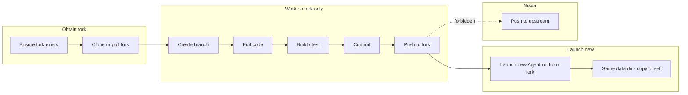

# Agent self-improvement: download Agentron and improve it via a fork only

## Goal

Define how an **agent** (running inside or alongside Agentron) can **download the Agentron software** and **improve it itself** when that is needed to improve its own functionality — with the strict constraint that **the agent never works on the original repo**: it only ever works on **its own fork**.

---

## 1. Principles

| Principle | Meaning |
|-----------|--------|
| **Fork-only** | All code changes happen in a **fork** of the Agentron repo. The agent never has write access to the upstream (original) repo and must never attempt to push to it. |
| **Download = clone fork** | “Download Agentron” means clone (or pull) the **agent’s fork** of the repo, not the upstream. The fork is the single source of truth for the agent’s improvements. |
| **Improvement when needed** | The agent improves the codebase only when it infers that doing so is necessary to improve its own functionality (e.g. missing tool, bug, or capability gap). |
| **Auditable** | All changes are in the fork as normal commits/branches; the user (or another process) can review, merge upstream, or discard. |
| **User can track; no data loss** | The user can see when and how the agent improved the platform and restarted. All persistent data is preserved or backed up so nothing is lost across restarts. |
| **Understand code; update docs** | When building a new version, the agent must **read and understand** the relevant parts of the codebase before editing. After changing code, the agent must **update documentation** (README, docs, architecture, .cursor/rules, etc.) so that it or another agent can quickly see what the repo does and how it is structured. |

---

## 2. When would the agent need to improve the software?

The agent might decide to change the Agentron codebase when:

- **Missing capability**: A task requires a tool or feature that does not exist (e.g. a new API, a new built-in tool, or a workflow primitive).
- **Bug or limitation**: The agent hits a bug or limitation (e.g. context size, tool behavior) that blocks its goals and can be fixed in code.
- **Self-improvement loop**: As in [agent_for_recursive_slm_improvement.md](agent_for_recursive_slm_improvement.md), the agent has improvement tools; extending the **platform** (Agentron) can be one optimization target (e.g. “add a tool that does X so future runs can use it”).

The agent should use a **decision step** (e.g. a tool like `decide_optimization_target` or a dedicated “should I change the codebase?”) so that codebase changes are explicit and scoped, not automatic on every failure.

---

## 3. Fork-first workflow (high level)

1. **Ensure fork exists**: The agent (or the system) ensures there is a fork of the upstream Agentron repo, owned by an identity the agent can use (e.g. a bot account or the user’s account). If not, the agent can only **create** the fork via an allowed path (e.g. GitHub API with token scoped to “create fork”), not by pushing to upstream.
2. **Clone or pull**: Clone the **fork** (e.g. `git clone https://github.com/<fork-owner>/agentron.git`) or, if already cloned, set `origin` to the fork and pull. **Upstream** is at most a read-only remote (e.g. `upstream`) for syncing.
3. **Create branch**: Create a feature branch on the fork (e.g. `agent-improvement/<short-description>`).
4. **Understand the code**: Read the repo structure and the relevant modules (packages, entry points, existing tools, docs) so edits are informed, not blind.
5. **Edit code**: Make changes using existing tools (edit files, run code, run tests). All edits are in the clone of the fork.
6. **Update documentation**: Update README, `docs/`, `INSTALL.md`, architecture notes, and/or `.cursor/rules` so the repo’s functions and structure stay clear for the next run or another agent.
7. **Build / test**: Run the project’s build and tests (e.g. `npm run build:ui`, tests) to validate.
8. **Commit**: Commit with a clear message (e.g. “Add X for capability Y”), including doc changes in the same commit or a follow-up.
9. **Push to fork**: Push the branch to the **fork** only (`origin` = fork). No push to upstream is ever attempted.
10. **Launch new version** (see §5.5): Optionally close the old Agentron instance and start the new build from the fork so the agent continues running in the improved software, with a copy of its state (agents, workflows, data).

---

## 4. Where the agent runs and where the repo lives

| Scenario | Where agent runs | Where fork is used |
|----------|------------------|---------------------|
| **Same machine** | Agentron (or its runtime) on the user’s machine | Clone the fork into a dedicated directory (e.g. `.data/agentron-fork/` or a configurable path). Agent runs tools (git, edit, build) in that directory. |
| **Sandbox / container** | Agent runs in a sandbox or container with tool access | Same idea: a workspace directory that is a clone of the fork; agent only ever pushes to the fork remote. |
| **CI / cloud** | Agent triggers jobs (e.g. “run tests on my branch”) | Clone from the fork; CI runs against the fork’s branch. No write to upstream. |

The important point: **one canonical “agent workspace”** = one clone whose `origin` is the fork. All git write operations go to that remote only.

**Restart after improve:** On the same machine, after building the fork, the agent can **launch the new version** from that build (see §5.5). The new process uses the same **data directory** (e.g. `.data/`) as the old one — or a copy of it — so the new instance has the same agents, workflows, and runs (“a copy of itself”) and the agent effectively continues in the improved software.

---

## 5. Tools the agent needs

To support “download Agentron and improve it via fork only,” the following capabilities should be available to the agent (as tools or clearly documented steps).

### 5.1 Fork and clone

| Tool / capability | Purpose |
|-------------------|--------|
| **ensure_agentron_fork** (or **get_agentron_fork**) | Ensure a fork of the upstream Agentron repo exists (e.g. under the configured GitHub user/org). Returns fork clone URL and default branch. If the user has not created a fork yet, returns instructions or (if permitted) creates the fork via API. |
| **clone_or_pull_agentron** | Clone the **fork** into the agent workspace (if not present) or pull latest from the fork. Accepts optional branch. **Never** clones upstream for the purpose of making edits; upstream is optional read-only for merge-base or sync. |

### 5.2 Git operations (fork-only)

| Tool / capability | Purpose |
|-------------------|--------|
| **create_branch** (in agentron workspace) | Create a new branch on the fork (e.g. `agent-improvement/add-foo-tool`). |
| **commit_changes** | Stage and commit in the workspace. Message should be descriptive (e.g. generated from the agent’s plan). |
| **push_to_fork** | Push the current branch to the **fork** remote only. Implementation must **forbid** pushing to any remote that is the upstream (original) repo. |

**Enforcement:**  
- Remotes are named explicitly: e.g. `origin` = fork, `upstream` = original (read-only).  
- Push is only allowed to `origin` (or a remote explicitly marked as “agent fork”).  
- A pre-push check or wrapper can verify `remote.url` is not the upstream repo URL before running `git push`.

### 5.3 Understand code, edit, update docs, build, test

**Understand the code before editing.** When building a new version, the agent must **go over the code** to understand it: read the repo layout (e.g. `packages/`, `apps/`, `docs/`), entry points, existing tools and APIs, and any architecture or concept docs. That way changes fit the existing structure and the agent does not edit blindly. Use normal read/search tools (list dirs, read files, semantic search) in the fork workspace.

**Update documentation after changing code.** So that the agent (or another agent) can quickly see what the repo does, the agent must **update the documentation** when it adds or changes behavior. Update as appropriate:

| What to update | Purpose |
|----------------|--------|
| **README.md** | High-level what the repo is, how to run, main packages. |
| **INSTALL.md** | Install and run steps if they changed. |
| **docs/** (e.g. `docs/architecture.md`, `apps/docs/`) | Architecture, concepts, new features or tools. |
| **.cursor/rules.md** or **.cursor/rules/** | Conventions and patterns so the next agent (or Cursor) follows them. |
| **Contracts / API docs** | If the agent adds or changes APIs or tools, document them (e.g. `contracts/`, or docstrings and generated docs). |

Include doc updates in the same commit as the code change (or a dedicated “docs: …” commit) so the fork stays self-describing.

| Tool / capability | Purpose |
|-------------------|--------|
| **Edit files** | Already available (e.g. via Cursor, or `run_code` / script that writes files in the workspace). Agent edits only inside the fork workspace. |
| **run_build_agentron** | Run the project’s build (e.g. `npm run build:ui` or full build) in the fork workspace. Returns success/failure and logs. |
| **run_tests_agentron** | Run tests in the fork workspace. Returns pass/fail and logs. |

These can be wrappers around existing `run_code` or shell tools, scoped to the fork workspace directory.

### 5.4 Optional: sync from upstream (read-only)

| Tool / capability | Purpose |
|-------------------|--------|
| **sync_fork_from_upstream** | Fetch from `upstream` and merge (or rebase) into the current branch so the fork’s branch is up to date with upstream. **No push to upstream.** Optionally the user runs this manually; the agent can call it only to update its working copy from upstream before making new changes. |

### 5.5 Launch new version (close old, start new with copy of self)

After improving and building the fork, the agent must be able to **run the improved software** so it continues in the new version. That means: **close the old Agentron instance** and **start the new one** from the fork build, with **the same state** (agents, workflows, runs, config) so it is “a copy of itself.”

| Tool / capability | Purpose |
|-------------------|--------|
| **launch_new_agentron** (or **restart_agentron_from_fork**) | From the fork workspace (after a successful build): (1) Start the new Agentron process from the fork (e.g. run the built UI + runtime, or the built Electron app from the fork’s `apps/desktop/release/` or equivalent). (2) Configure the new process to use the **same data directory** as the current instance (or a copy of it — see below). (3) Optionally signal or trigger **shutdown of the current (old) instance** after the new one is up, so only one “active” instance runs and the agent continues in the new version. |

**State = “copy of itself”:**

- The **new** instance must see the same agents, workflows, improvement jobs, and (optionally) recent runs and chat state as the **old** instance. That implies reusing or copying the **persistent data** the app uses (e.g. SQLite DB, `.data/` directory with config, runs, RAG, etc.).
- **Preferred:** The new process is started with the **same data path** (e.g. `AGENTRON_DATA_DIR` or `--data-dir` pointing at the existing `.data/`). No copy needed; the new process attaches to the same DB and files. The old process must **exit** (or release the DB) so the new one can open it; so the sequence is either “start new → then exit old” or “exit old → start new” (with a launcher script or wrapper that does both).
- **Alternative:** If the old process cannot be stopped first (e.g. the agent runs inside it), the flow can be “copy `.data/` to a new path → start new instance with that path → old instance exits when the user or a watchdog stops it.” Then the “current” agent run finishes in the old instance, and the next interaction happens in the new instance with the copied state.

**How to start the new version:**

- **Dev (Next.js + runtime):** From the fork workspace, run `npm run dev:ui` (or equivalent) in a new process, with env pointing `AGENTRON_DATA_DIR` (or equivalent) to the same directory the current app uses. The “close old” step may require a separate mechanism (e.g. the agent calls a tool that asks the host to “restart the app from the fork” and the host kills the current Node process and starts the new one).
- **Desktop (Electron):** Build the desktop app from the fork (`npm run dist --workspace apps/desktop`); then run the built executable (e.g. `apps/desktop/release/Agentron Studio.exe` on Windows) with the same user data directory. The Electron app typically has a known data path (e.g. `%APPDATA%/agentron-studio` or similar); the new build should use that same path so it sees the same state. Then quit the old app (the agent can trigger “quit” via a tool if the app exposes it, or the user closes the old window).
- **Server / headless:** Stop the current Node process; start the new one from the fork (e.g. `node ...` or `npm start` from the fork workspace) with the same data directory. A **launcher script** or a **supervisor** (systemd, PM2, etc.) can do “start new → stop old” or “stop old → start new” so the agent’s “restart” tool only invokes that script.

**Safety and scope:**

- **launch_new_agentron** should only start the **Agentron** app from the **fork workspace** (and only after a successful build). It must not kill arbitrary processes; at most it triggers “exit this process” or “run this launcher script” that is configured to restart only the app. The user (or deployer) can restrict the tool to a single allowed command (e.g. a script that starts the fork build and optionally stops the current process).
- If the agent runs **inside** the current Agentron process, “close old” is delicate: the run that called **launch_new_agentron** will be interrupted when the process exits. So the intended use is: “I’ve built the new version; when you (user) or the launcher restarts the app from the fork, the new instance will have my state and I’ll continue there.” Alternatively, the tool can **schedule** a restart (e.g. “on next idle” or “after this run completes”) and return success, and a separate watchdog or the user performs the actual restart.

**Summary (launch):**

| Concern | Approach |
|--------|-----------|
| **Close old, open new** | Start new process from fork build; then stop old process (or stop old then start new via launcher). New process uses same data path so it sees the same state. |
| **Copy of itself** | Same agents/workflows/runs by using the **same data directory** (or a one-time copy of `.data/`) for the new instance. No schema change required. |
| **Tool** | **launch_new_agentron**: start Agentron from fork workspace with same data dir; optionally trigger/schedule shutdown of current instance. Scope limited to “this app only.” |

---

## 6. User tracking and no data loss

The user must be able to **track** self-improvement cycles (what changed, when the agent restarted) and be assured that **no data is lost** when the old instance is replaced by the new one.

### 6.1 How the user can track

| Mechanism | Purpose |
|-----------|--------|
| **Platform improvement history** | A persistent log (e.g. in `.data/` or the app DB) of **platform improvement events**: timestamp, fork branch name, commit hash, short summary (“Added tool X”), and whether a restart was requested or performed. The user can open a “Platform history” or “Self-improvement” view in the UI to see this list. |
| **Runs / execution trail** | Any run that performed codebase edits or **launch_new_agentron** appears in the normal **Runs** list with a clear label (e.g. “Platform improvement”) and a link to the branch/commit. So the user can trace “this run changed the codebase and restarted.” |
| **Chat and report** | The agent reports in chat what it did (“I’ve pushed branch … and started the new version”). That message stays in conversation history so the user has a narrative record. |
| **Optional: confirm before restart** | A setting or guard can require **user confirmation** before **launch_new_agentron** actually starts the new process (e.g. a modal: “Agent wants to restart into the new build from branch X. Your data will stay in the same folder. Continue?”). The user can then track that they explicitly approved the restart. |

### 6.2 No data loss: guarantees and mechanisms

| Guarantee | How it’s achieved |
|-----------|--------------------|
| **Same data path** | The new instance is always started with the **same data directory** as the old one (e.g. `AGENTRON_DATA_DIR`). The new process does not create an empty `.data/` elsewhere; it reuses the existing one. So agents, workflows, runs, and chat state are not recreated from scratch — they are the same files and DB. |
| **Backup before first restart (optional but recommended)** | Before the **first** time the agent triggers a restart from a fork build, the system can **copy** the current `.data/` to a timestamped backup (e.g. `.data/backups/pre-restart-<iso-date>/`). That way, if anything goes wrong, the user can restore. Subsequent restarts can reuse the same data path without overwriting; backup can be done once per “improvement session” or on a schedule. |
| **Verification after new instance starts** | After the new instance is up, it can write a **verification record** (e.g. “Started at \<time\>; data dir = \<path\>; agent count = N; run count = M”). That record is appended to the platform improvement history. The user (or a simple health view) can confirm that agent count and run count match expectations — i.e. no data loss. |
| **No overwrite of live data** | **launch_new_agentron** must never start the new process with a **different** data directory that would point at an empty or stale copy. The only allowed pattern is: same path (and old process has exited), or an explicit one-time copy that the user or config has approved. |

### 6.3 Summary (tracking and data safety)

| Concern | Approach |
|--------|-----------|
| **User can track** | Platform improvement history (log of branch, commit, restart); runs list shows “Platform improvement” runs; agent reports in chat; optional confirm-before-restart. |
| **No data loss** | New instance uses **same data directory**; optional backup before first restart; verification record after start (e.g. agent/run counts); no overwrite of live data. |

---

## 7. Enforcing “never push to original repo”

### 7.1 Configuration

- **Fork remote**: Store the fork’s clone URL (e.g. `https://github.com/<fork-owner>/agentron.git`) in config or env (e.g. `AGENTRON_AGENT_FORK_URL`).
- **Upstream URL**: Store the upstream repo URL (e.g. `https://github.com/<original-owner>/agentron.git`) for two purposes: (1) read-only remote, (2) **blocklist** for push.

### 7.2 Push guard

- Before any `git push`, the code (or a small wrapper script) checks that the push target remote’s URL is **not** the upstream URL (and optionally that it **is** the configured fork URL).
- If the target is upstream, abort with a clear error: “Agent is not allowed to push to the original repo; push only to your fork.”
- Only allow push to the single “fork” remote.

### 7.3 No upstream write credentials

- The agent (or the process running the agent) should **not** have credentials that grant write access to the upstream repo. Use a token or SSH key that has access only to the fork (e.g. a bot user that only has access to the forked repo). That way even a bug cannot push to upstream.

---

## 8. End-to-end flow (agent perspective)

1. **Decide**: The agent infers that improving the Agentron codebase is needed (e.g. via `decide_optimization_target` or task context). It plans the change (e.g. “Add tool X,” “Fix bug Y”).
2. **Ensure fork**: Call **ensure_agentron_fork**; get fork URL.
3. **Clone/pull**: Call **clone_or_pull_agentron** (fork, optional branch). Workspace is now at the fork’s state.
4. **Branch**: Call **create_branch** with a descriptive name.
5. **Understand the code**: Read the repo (structure, `packages/`, `apps/`, `docs/`, existing tools and APIs) so the change fits the codebase. Do not edit blindly.
6. **Edit**: Use file-edit tools to implement the change in the workspace.
7. **Update documentation**: Update README, docs, INSTALL, architecture, and/or `.cursor/rules` so the repo’s functions and structure remain clear for the next run or another agent. Include in the same commit (or a docs-only commit).
8. **Build**: Call **run_build_agentron**; fix issues if build fails.
9. **Test**: Call **run_tests_agentron**; fix issues if tests fail.
10. **Commit**: Call **commit_changes** with a clear message (code + docs).
11. **Push**: Call **push_to_fork**. Guard ensures push goes only to the fork.
12. **Launch new version**: Call **launch_new_agentron** so the improved build starts with the same data directory (same agents, workflows, runs). The old instance is closed (by the tool, a launcher, or the user); the agent continues in the new instance (“copy of itself”).
13. **Report**: The agent can report to the user: “I’ve pushed branch `agent-improvement/add-foo-tool` to my fork and started the new version; I’m now running in the updated build.” The user can open a PR to upstream if they want to merge.

The user (or a separate process) can then open a pull request from the fork to upstream, or keep the changes only in the fork.

---

## 9. Summary table

| Concern | Approach |
|--------|-----------|
| **Download Agentron** | Clone (or pull) the **agent’s fork**, not upstream. Fork is the working copy. |
| **Improve when needed** | Agent decides (e.g. via optimization-target or task need) to change the codebase; then branch → edit → build → test → commit → push to fork. |
| **Never work on original repo** | (1) All edits and pushes go to the fork only. (2) Push guard blocks any push to upstream URL. (3) Use credentials that have no write access to upstream. |
| **Tools** | ensure_agentron_fork, clone_or_pull_agentron, create_branch, commit_changes, push_to_fork, run_build_agentron, run_tests_agentron, **launch_new_agentron**; optional sync_fork_from_upstream. |
| **Launch new version** | After build: start new Agentron from fork with **same data directory** (same agents, workflows, runs); close old instance so the agent continues in the improved build (“copy of itself”). |
| **User tracking** | Platform improvement history (branch, commit, restart); runs list shows platform-improvement runs; agent reports in chat; optional confirm before restart. |
| **No data loss** | New instance uses **same data path**; optional backup before first restart; verification record after start (e.g. agent/run counts); no overwrite of live data. |
| **Understand code; update docs** | Before editing: **read and understand** the repo (structure, packages, tools, docs). After changing code: **update documentation** (README, docs/, INSTALL, architecture, .cursor/rules) so the agent or another agent can quickly see the repo’s functions and structure. |
| **Auditability** | All changes are commits on branches in the fork; user can review and open PRs to upstream. |

This plan keeps the agent’s improvements **inside a fork** and makes it impossible for the agent to modify the original repo, while still allowing it to download (clone) Agentron, improve it, and **launch the new version for itself** so it keeps running in the updated software with its state preserved. The **user can track** every improvement and restart, and **no data is lost** thanks to a fixed data path, optional backup, and verification.
