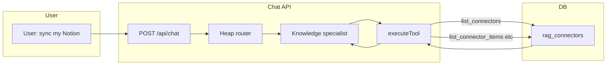
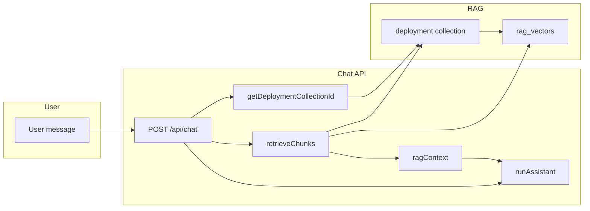

# Chat UX for Integrations (Knowledge Connectors)

## Overview

Improve Agentron chat UX for Knowledge connectors: ensure authentication is requested or clearly guided when missing, register connector tools in the heap, give the assistant visibility of configured connectors, and add UX polish (deep links, error guidance, empty state, trace labels).

---

## Current state

- **Connector tools** are in `ASSISTANT_TOOLS` and implemented in execute-tool. They work in **non-heap** mode only.
- **Heap registry** has no specialist that includes connector tools; in heap mode the assistant cannot act on "sync my Notion" or "list files in my Drive."
- **StudioContext** has tools, agents, workflows, llmProviders but **no connectors**; the assistant will discover connector IDs via the **list_connectors** tool (to be added).
- **Auth failures**: Browse/connector-write return plain `{ error: "..." }` with no hint to configure in Knowledge → Connectors; no prompt instruction for the assistant to relay that.
- **Chat UI**: Errors show as "Error: …" with Retry + "View stack trace"; no contextual "Open Knowledge" for connector errors. Trace steps show raw `specialistId` (e.g. "knowledge"). ask_user/ask_credentials show interactive options; credential form exists for vault/workflows but connectors are configured in Knowledge, not in-chat.
- **Knowledge page**: Sync failure shows `alert(data?.error)` and connector card shows `c.status` ("error") and lastSyncAt; the **exact error message** (e.g. "serviceAccountKeyRef env var not set") is not shown on the card, only in the sync alert.

---

## Plan

### 1. Register connector tools in the heap

- Add a **"knowledge"** specialist in [packages/runtime/src/chat/heap/registry.ts](packages/runtime/src/chat/heap/registry.ts):
  - `id`: `"knowledge"`
  - `description`: e.g. "Knowledge connectors: list connectors, list items, read or update content in Notion, Drive, local folders, etc. Use list_connectors to discover connector ids."
  - `toolNames`: `["list_connectors", "list_connector_items", "connector_read_item", "connector_update_item", "ask_user", "format_response"]` (within SPECIALIST_TOOL_CAP)
- Append `"knowledge"` to `topLevelIds` in `buildDefaultRegistry()`.

**Files**: [packages/runtime/src/chat/heap/registry.ts](packages/runtime/src/chat/heap/registry.ts).

---

### 2. list_connectors tool (assistant discovers connectors by tool)

- **Add `list_connectors` tool** so the assistant can discover configured connectors instead of relying only on studio context (avoids trimmed context and allows refresh).
- **Runtime definition**: In [packages/runtime/src/chat/tools/connector-tools.ts](packages/runtime/src/chat/tools/connector-tools.ts) add a tool:
  - `name`: `"list_connectors"`
  - `description`: "List Knowledge connectors (id, type, collectionId). Use returned ids with list_connector_items, connector_read_item, connector_update_item. Call this when the user asks to sync, list, read, or update content in a connected source (Notion, Drive, etc.) so you know which connector ids exist."
  - `parameters`: `{ type: "object", properties: {}, required: [] }`
- **Execute-tool handler**: In [packages/ui/app/api/chat/_lib/execute-tool.ts](packages/ui/app/api/chat/_lib/execute-tool.ts) add case `"list_connectors"`: query `ragConnectors`, return `rows.map(r => ({ id: r.id, type: r.type, collectionId: r.collectionId }))`.
- **Register** in the knowledge specialist (see §1) and in CONNECTOR_TOOLS array.

**Files**: [packages/runtime/src/chat/tools/connector-tools.ts](packages/runtime/src/chat/tools/connector-tools.ts), [packages/ui/app/api/chat/_lib/execute-tool.ts](packages/ui/app/api/chat/_lib/execute-tool.ts).

---

### 3. Studio context connectors (required)

- **Expose connectors in studio context** so the assistant sees them in the initial prompt (smaller first turn) in addition to discovering via list_connectors. Extend `StudioContext` in [packages/runtime/src/chat/assistant.ts](packages/runtime/src/chat/assistant.ts) with `connectors: { id: string; type: string }[]`; load ragConnectors in the chat route and inject into system prompt (e.g. "Configured connectors: id, type for each").

**Files**: [packages/runtime/src/chat/assistant.ts](packages/runtime/src/chat/assistant.ts), [packages/ui/app/api/chat/_lib/chat-route-post.ts](packages/ui/app/api/chat/_lib/chat-route-post.ts).

---

### 4. Auth-related errors: clear messaging and assistant guidance

- **Error message hint**: When execute-tool catches an error from connector browse/write that matches auth/credentials/env/token/service account, append: " Configure this connector in Knowledge → Connectors and set the required credential (env var or key)."
- **System prompt block**: In [packages/runtime/src/chat/tools/prompt.ts](packages/runtime/src/chat/tools/prompt.ts) add a block: when `list_connector_items`, `connector_read_item`, or `connector_update_item` returns an error mentioning authentication, credentials, env var, or token, tell the user to open **Knowledge → Connectors**, select the connector, and set the required credential; do not invent env var names.
- **Empty connectors**: When `list_connectors` returns an empty list and the user asks to sync/list/read a source (Notion, Drive, etc.), the assistant should say they have no connectors and direct them to add one in **Knowledge → Connectors** first.

**Files**: [packages/ui/app/api/chat/_lib/execute-tool.ts](packages/ui/app/api/chat/_lib/execute-tool.ts), [packages/runtime/src/chat/tools/prompt.ts](packages/runtime/src/chat/tools/prompt.ts).

---

### 5. Chatting with content across connectors

**Can the user chat with their content from connectors?** Yes, with the current design, under these conditions:

- **Deployment collection**: Studio chat uses exactly one RAG collection — the one with scope **deployment** (`getDeploymentCollectionId()`). All retrieval in chat comes from that collection.
- **Connectors → collection**: Each connector is tied to a **collection** (user chooses when adding the connector). If the user attaches connectors to the **deployment** collection, synced files go into that collection’s document store (`rag_documents`).
- **Sync → documents only**: Sync writes files into the document store and creates `rag_documents` rows. Content is **not** yet in the vector store.
- **Ingest → searchable**: The user must **Ingest** documents (chunk + embed → `rag_vectors` or external vector store). Knowledge page shows "Upload to studio knowledge" with a document list for the deployment collection; that list includes both uploaded and **synced** documents. User clicks Ingest per document (or we add bulk ingest).
- **Retrieve**: On each user message, chat calls `retrieveChunks(deploymentCollectionId, userMessage, limit)` and injects the result as `ragContext` into the system prompt. So once documents from any connector (pointing at the deployment collection) are ingested, chat can use that content.

**What we need for a good “chat with my connector content” UX:**

| Need | Action |
|------|--------|
| Clarity | In Knowledge UI, state that "Connectors that sync to the **deployment** collection are searchable in chat after you Ingest their documents." Optionally when creating/editing a connector, show which collection is the deployment one. |
| Bulk ingest | **Required.** Add "Ingest all" for the deployment collection; API accepts `collectionId` and ingests all docs in that collection. |
| Ingest-after-sync | **Required.** After connector sync, trigger ingest for newly synced documents. Add "Ingest after sync" option on connector (default on when connector's collection is deployment); run ingest for new doc ids after sync completes. |
| No change to retrieve | Chat already uses the deployment collection; all connectors pointing to it are already "content across connectors" once ingested. |

**Files**: [packages/ui/app/api/rag/ingest/route.ts](packages/ui/app/api/rag/ingest/route.ts) (POST with collectionId to ingest all docs), [packages/ui/app/knowledge/page.tsx](packages/ui/app/knowledge/page.tsx) (Ingest all button), [packages/ui/app/api/rag/connectors/[id]/sync/route.ts](packages/ui/app/api/rag/connectors/[id]/sync/route.ts) (after sync, if "Ingest after sync" enabled, call ingest for new doc ids); connector config for ingestAfterSync.

---

### 5.1 Ingest UI/UX today and improvements

**Current behavior (Knowledge → Collections → deployment collection → “Upload to studio knowledge”):**

- Document list shows all documents in the deployment collection (uploads and **synced** connector files). Heading says “Uploaded documents,” which is misleading for synced items.
- **Per-document only**: One “Ingest” button per row; no “Ingest all.” For many synced files, the user must click each row.
- **Feedback**: Success and failure use `alert()`. No inline toast or status; no progress for multiple docs.
- **Copy**: Explains “Upload .txt or .md … Then click Ingest to chunk and embed” but does not state that synced connector docs appear here or that the deployment collection is what powers chat.

**Is it user-friendly?** Partially. It works for a few docs, but scale (many synced files) and feedback are weak; terminology (“Uploaded documents”) hides that syncs are included.

**Improvements:**

| Area | Change |
|------|--------|
| Copy | Rename “Uploaded documents” to “Documents” or “Documents in this collection (uploads + synced).” Add one line: “Connectors that sync to this collection appear here; Ingest makes them searchable in chat.” |
| Feedback | Replace `alert()` with inline success/error (e.g. small status under the list or a toast). Show “Ingested N chunks” or error per document or for bulk. |
| Bulk | **Required.** Add "Ingest all" button; API accepts `collectionId` and ingests all docs in that collection (or client loops POST per doc). |
| Ingest-after-sync | **Required.** Connector config has "Ingest after sync"; after sync completes, trigger ingest for newly synced documents (see §5). |

**Assistant ingest on request:** Today the assistant **cannot** ingest. There is no ingest tool. To allow “ingest my knowledge” / “make my new Notion docs searchable” in chat:

- **Add a tool** (e.g. `ingest_deployment_documents`) that triggers ingest for **all documents in the deployment collection**. No parameters (server uses `getDeploymentCollectionId()`). Implementation: extend POST [packages/ui/app/api/rag/ingest/route.ts](packages/ui/app/api/rag/ingest/route.ts) to accept optional `collectionId`; when provided, ingest every document in that collection (or add a dedicated route e.g. POST `/api/rag/ingest-all` that uses deployment collection). Execute-tool handler calls that API and returns a summary (e.g. “Ingested 12 documents, 156 chunks” or errors).
- **Register** the tool in the knowledge specialist and in CONNECTOR_TOOLS (or a shared RAG tools list). Prompt: when the user asks to ingest, index, or “make my docs searchable,” the assistant can call this tool.
- **Optional**: Tool that takes `documentIds: string[]` for partial ingest (assistant would need `list_documents` to get IDs; more flexible but more tool calls).

**Files:** [packages/ui/app/knowledge/page.tsx](packages/ui/app/knowledge/page.tsx) (copy, Ingest all button, replace alert), [packages/ui/app/api/rag/ingest/route.ts](packages/ui/app/api/rag/ingest/route.ts) (support collectionId to ingest all), [packages/runtime/src/chat/tools/connector-tools.ts](packages/runtime/src/chat/tools/connector-tools.ts) (or rag-tools) + [packages/ui/app/api/chat/_lib/execute-tool.ts](packages/ui/app/api/chat/_lib/execute-tool.ts) (ingest_deployment_documents), heap registry (add to knowledge specialist).

---

### 6. Additional UX (from research)

#### 6.1 Deep link to Knowledge / Connectors from chat

- When the assistant’s reply directs the user to configure a connector (auth error or “add a connector”), **render a clickable link** so the user can jump straight to the right place.
- **Options**: (a) Assistant uses markdown `[Knowledge → Connectors](/knowledge)` (sidebar already has Knowledge; user opens Knowledge and clicks Connectors tab). (b) Optional: support hash or query for tab, e.g. `/knowledge?tab=connectors`, and open Connectors tab by default when present. (c) Optional: add a small “Open Connectors” button/link in the error UI when the last tool result was a connector tool error (in chat-section-message-row or chat-modal).
- Ensure prompt instructs the assistant to output a markdown link to `/knowledge` when directing the user to configure connectors; add `?tab=connectors` support and handle it on the Knowledge page to open the Connectors tab.

**Files**: [packages/runtime/src/chat/tools/prompt.ts](packages/runtime/src/chat/tools/prompt.ts) (instruction to use link), [packages/ui/app/knowledge/page.tsx](packages/ui/app/knowledge/page.tsx) (read searchParams and set activeTab to "connectors" when `?tab=connectors`).

#### 6.2 Human-readable specialist label in trace/loading

- Trace steps and loading status show raw `specialistId` (e.g. "knowledge", "workflow"). For **knowledge**, show a friendlier label so the user sees e.g. "Knowledge / integrations" instead of "knowledge".
- **Options**: (a) In [packages/ui/app/components/chat-message-content.tsx](packages/ui/app/components/chat-message-content.tsx) in `getLoadingStatus()`, map `specialistId` to a display name (e.g. `knowledge` → "Knowledge"). (b) Or store a displayLabel in the registry and pass it in trace steps (larger change). (a) is minimal and sufficient.

**Files**: [packages/ui/app/components/chat-message-content.tsx](packages/ui/app/components/chat-message-content.tsx).

#### 6.3 Connector lastError on card (required)

- Today the connector card shows `c.status` ("synced" / "error") and lastSyncAt; the **exact error message** is only in the alert when the user clicks Sync. If the user was directed from chat to “configure the connector,” they may not have triggered Sync recently.
- **Required**: Persist the last error message when sync fails (e.g. store in connector row or `config.lastError`); return it from the connectors API and show it on the card when status is "error". User can fix auth/config without clicking Sync again.

**Files**: Backend: [packages/ui/app/api/rag/connectors/[id]/sync/route.ts](packages/ui/app/api/rag/connectors/[id]/sync/route.ts) (store last error in DB or in connector config if schema allows), or leave as-is and only show in alert. Frontend: [packages/ui/app/knowledge/page.tsx](packages/ui/app/knowledge/page.tsx) (show lastError when status === "error"). Note: schema may not have lastError; could use connector.config.lastError or a new column.

---

## Data flow

**Connector tools (list/sync/read/update):** Assistant discovers connectors via `list_connectors`, then calls `list_connector_items` / `connector_read_item` / `connector_update_item` with the chosen id.

**Chat with content (RAG):** User message is used to retrieve relevant chunks from the deployment collection; that context is injected into the assistant. Connector content is included only after sync and ingest.

---

## Testing

### Unit / API tests

- **Heap**: After adding the knowledge specialist, run a heap-mode chat that asks to "list items in my X connector"; confirm the router can select the knowledge specialist and the tool is called.
- **Studio context**: Assert that when ragConnectors has rows, `studioContext.connectors` is populated with id and type.
- **Auth error**: When browse/connector-write throws an auth-related error, assert the execute-tool response (or assistant output) directs the user to Knowledge → Connectors.
- **Empty connectors**: When connectors list is empty and user asks to sync Notion, assert assistant directs to add a connector in Knowledge → Connectors.
- **Deep link**: Assert that opening `/knowledge?tab=connectors` focuses the Connectors tab.
- **Trace label**: Verify loading status shows "Knowledge" (or chosen label) when specialistId is "knowledge".
- **lastError**: When sync fails, assert connector record has lastError and list-connectors (or GET connectors) returns it; Knowledge UI test can assert error state card shows the message.
- **Bulk ingest**: POST ingest with collectionId returns success and document count; or unit-test the route with multiple docs.
- **Ingest-after-sync**: After sync returns, if ingestAfterSync is true, assert ingest was invoked for new doc ids (mock or integration test).

### E2E tests

Add e2e tests under [packages/ui/__tests__/e2e/](packages/ui/__tests__/e2e/) to cover behaviour end-to-end. Do **not** cover every connector type in e2e; rely on unit/API tests for most. For e2e, focus on:

| Priority | What to test | Connector(s) | Notes |
|----------|--------------|--------------|--------|
| 1 | Full flow: add connector → sync → documents appear → Ingest all → list_connectors / list_connector_items in chat | **Filesystem (local path)** | No external credentials; use a temp dir. Create deployment collection, add filesystem connector, sync, open chat (heap mode), ask "list my connectors" then "list items in my X connector"; assert tool calls and response. Optionally ingest and ask a question about content. |
| 2 | Same flow with auth: test that real auth works | **Google Drive**, **Notion** | E2E **prompts the user to authenticate** both Notion and Google Drive during the test run (e.g. test opens Knowledge → user adds connector → app shows auth/OAuth or credential UI → user completes auth → test continues with sync / list_connector_items). This verifies that the auth flow works end-to-end; no silent skip when creds missing. Run locally (or in CI with interactive auth if supported). |
| 3 | Optional second cloud for breadth | **Confluence** or **Dropbox** | Same pattern: conditional e2e when E2E_CONFLUENCE_* or E2E_DROPBOX_* are set. |

**E2E scenarios to implement:**

- **knowledge-connectors-filesystem.e2e.ts**: Create deployment collection + encoding + store if needed; create temp dir with 1–2 .md files; add filesystem connector pointing at temp dir with "Ingest after sync" on; trigger sync; assert documents in collection; assert "Ingest all" (or ingest API) succeeds; in heap chat, send "list my connectors" and assert list_connectors result contains the connector; send "list items in my filesystem connector" and assert list_connector_items returns items. Optionally "ingest my knowledge" and one Q&A turn with RAG.
- **knowledge-connectors-google-drive.e2e.ts** and **knowledge-connectors-notion.e2e.ts**: **Ask the user to authenticate** during the run so we can test that auth works. Flow: test opens Knowledge → Connectors; user adds Google Drive (or Notion) connector; app shows auth/credential UI; test pauses or prompts user to complete OAuth / set credentials; once auth is done, test continues (sync or list_connector_items) and asserts success. This validates the full auth + connector flow; do not skip silently when creds are missing—instead prompt for auth so the run can verify it.
- **knowledge-ux.e2e.ts**: (1) Open Knowledge → Connectors; add a connector that will fail (e.g. invalid config); trigger Sync; assert card shows status "error" and **lastError** text on card. (2) Open `/knowledge?tab=connectors` and assert Connectors tab is active. (3) Deployment collection: upload a file, click "Ingest all", assert success feedback (no alert; inline or toast). (4) Optional: assistant reply contains link to /knowledge and link is clickable.

**Which connectors to try in e2e:** Filesystem (always, no auth). **Google Drive and Notion: e2e asks the user to authenticate** so we can test that auth works; run when you want to verify the real auth flow. Optional: Confluence or Dropbox (when creds set). Other integrations stay unit/API tested; user can manually verify.

---

## Summary

| Item | Action |
|------|--------|
| Heap | Add "knowledge" specialist with list_connectors, list_connector_items, connector_read_item, connector_update_item, ask_user, format_response; add to topLevelIds. |
| list_connectors | Add tool that returns { id, type, collectionId }[] from rag_connectors; register in CONNECTOR_TOOLS and knowledge specialist so the assistant discovers connectors by tool. |
| Studio context | **Required.** Add connectors to StudioContext (id, type) for initial prompt; load in chat route and inject. |
| Auth UX | Append "Configure in Knowledge → Connectors…" to connector tool errors when auth-related; add prompt block; when list_connectors returns empty, direct user to add a connector. |
| Chat with content | Document flow: deployment collection + connectors syncing to it + Ingest = chat can use that content. Add clarity in Knowledge UI. |
| Bulk ingest | **Required.** API: POST ingest with collectionId to ingest all docs; Knowledge UI: "Ingest all" button; replace alert with inline/toast feedback. |
| Ingest-after-sync | **Required.** Connector option "Ingest after sync"; after sync, trigger ingest for new doc ids when enabled. |
| Assistant ingest | Add ingest_deployment_documents tool (no params); register in knowledge specialist. |
| Deep link | Prompt assistant to output markdown link to /knowledge; support ?tab=connectors and open Connectors tab on Knowledge page. |
| Trace label | Map specialistId "knowledge" to display name "Knowledge" in getLoadingStatus (chat-message-content). |
| lastError on card | **Required.** Persist lastError on sync failure; return from connectors API; show on connector card when status is "error". |
| E2E | Add e2e tests: filesystem connector flow (always); Google Drive + Notion e2e **prompt user to authenticate** during the run to verify auth works; knowledge-ux (lastError on card, ?tab=connectors, Ingest all feedback). |

This keeps configuration in one place (Knowledge → Connectors), lets the assistant discover connectors via list_connectors and studio context, requires bulk ingest, ingest-after-sync, and lastError on card, and adds e2e coverage for filesystem plus Google Drive and Notion e2e that ask the user to authenticate so we can test that auth works.
