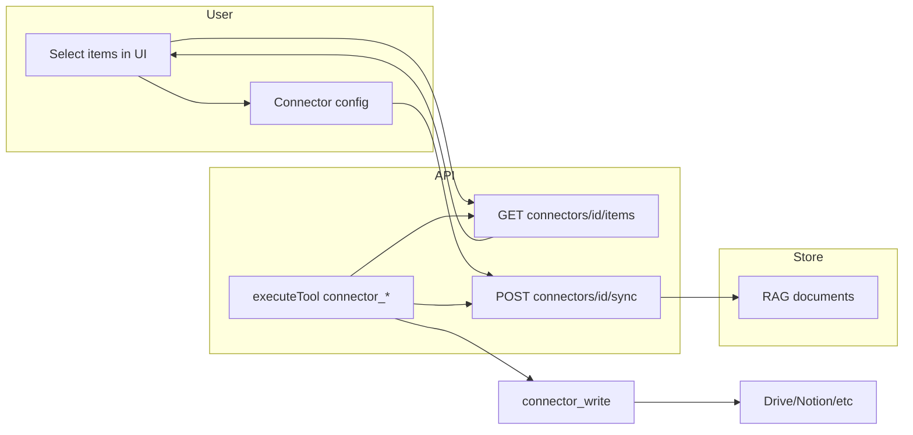

# Connectors: Selective Sync and Write Tools

## Overview

Address two gaps: (1) **data pollution** — users must be able to choose which files/pages from a connector get synced, not index a whole drive or space; (2) **bidirectional use** — agents and Agentron should be able to update content in connections (edit files, update pages) via tools, not only read/sync.

---

## Part 1: Selective sync (avoid indexing everything)

### Problem

Today, connector sync pulls **all** items in scope (e.g. all files in a Drive folder, all pages in a Notion search, all files in a local path). That can:

- Ingest far more than the user needs (noise, quota, cost).
- Be unacceptable for large drives or spaces.

### Approach

- **Connector config** remains a single JSON blob (no schema change). Add optional fields:
  - **`includeIds`** (string[]): If present and non-empty, sync **only** items whose external id is in this list. Enables “sync only these N items.”
  - **`excludePatterns`** (string[]): Glob or regex patterns (e.g. `["*.tmp", "/Archive/*"]`). Items whose name or path matches are **skipped**. Applied when not using includeIds (or as a filter in addition to includeIds, depending on product choice).
- **Default behavior**: If `includeIds` is absent or empty, keep current “sync all in scope” behavior so existing connectors are unchanged.
- **Sync handlers**: In each sync path (Google Drive, Dropbox, filesystem, Notion, etc.), after listing items, filter:
  - If `config.includeIds` is a non-empty array: keep only items whose id is in `includeIds`.
  - If `config.excludePatterns` is a non-empty array: exclude items whose name/path matches any pattern.
- **UI**: Let the user **select which items** to sync:
  - **Browse API**: New endpoint `GET /api/rag/connectors/:id/items` (or `:id/browse`) that uses the connector’s credentials to **list** items (files, pages) **without** downloading or writing to the document store. Returns `{ items: { id, name, type?, path? }[] }` so the UI can show a picker.
  - **Knowledge → Connectors**: For a connector, show “Select items” (or “Edit selection”): call browse, show list with checkboxes (or multi-select), then PATCH the connector’s `config` with the chosen `includeIds` (and optionally edit `excludePatterns` in a simple form). Sync then only syncs selected items.
  - **“Select all” for text-based connectors**: For knowledge databases that are mainly text-based and typically smaller (Notion, Obsidian, LogSeq, Confluence, GitBook, BookStack), add a **“Sync all”** (or “Select all”) option in the item picker. Choosing it clears `includeIds` so sync uses the default “all in scope” behavior—no need to tick every item. Keep “Select items” for choosing a subset when the user wants to limit what is synced.

### Implementation notes

- **Browse per connector type**: Each provider needs a small “list only” implementation (reuse auth/list logic from sync, but return lightweight metadata and do not write to store). Can live in `sync-cloud.ts` and `sync-local-path.ts` as `listDropboxItems()`, `listDriveItems()`, etc., or in a dedicated `connectors/_lib/browse.ts`.
- **Local path (filesystem, Obsidian, LogSeq)**: Browse = read directory tree and return paths/names; id can be path or relative path.
- **Pagination**: Browse may return many items; support `?pageToken=` or `?limit=&offset=` so the UI can page. Start with a reasonable limit (e.g. 200) and optional nextPageToken in response.
- **Tests**: Add tests for sync with `includeIds` (only listed ids synced) and with `excludePatterns` (matching items skipped); add tests for browse endpoint (returns list, no documents created).

---

## Part 2: Write/update tools for connections

### Goal

Agents (and the chat assistant) can **update** content in connected services via tools: e.g. update a Google Drive file, append to a Notion page, edit an Obsidian note, update a Confluence page.

### Tool design

- **Naming**: Prefer a small set of tools that can be implemented per connector type, e.g.:
  - **`list_connector_items`** — List items in a connector (by connectorId; optional path/folder). Returns id, name, type. Uses same browse logic as Part 1; can be shared with UI.
  - **`connector_read_item`** — Read raw content of one item (connectorId, itemId or externalId). Useful so the agent can “read then update.”
  - **`connector_update_item`** — Create or update one item: connectorId, itemId (or path for local), content (text/markdown) or patch. Semantics per type: Drive = update file content; Notion = update block; Confluence = update page body; Obsidian/LogSeq = write file.
- **Auth**: Tools use the **connector’s stored config** (serviceAccountKeyRef, accessTokenRef, etc.). No extra auth in the tool; the connector must already be configured with write-capable credentials where the provider requires it (e.g. Drive needs drive.file scope for write, not only readonly).
- **Scopes**: For Google Drive (and similar), document that “sync” uses read-only scope; “update” requires adding write scope (e.g. drive.file) and possibly re-auth. UI or docs can note “enable write” for the connection.

### Where to implement

- **execute-tool**: Add handlers in `execute-tool.ts` (or a dedicated `execute-tool-handlers-connectors.ts`) for:
  - `list_connector_items(connectorId, options?)`
  - `connector_read_item(connectorId, itemId)`
  - `connector_update_item(connectorId, itemId, content)` (and optionally `createIfMissing`, `append` for Notion-style append).
- **Connector write module**: New module (e.g. `api/rag/connectors/_lib/connector-write.ts`) that, given connector id, loads connector + config, dispatches by type to provider-specific update (Drive PATCH, Notion PATCH block, Confluence PUT page, local fs write). Use `fetch` for cloud APIs so tests can mock.
- **Runtime tool definitions**: Add tool definitions (name, description, inputSchema) for the assistant in `packages/runtime` (e.g. in agent-tools or a new connector-tools file) so the LLM knows about list_connector_items, connector_read_item, connector_update_item. Descriptions should say “connectorId from Knowledge → Connectors” and “itemId from list_connector_items or from RAG document externalId.”

### Safety and UX

- **Confirmation**: For `connector_update_item`, consider a first-time or high-impact confirmation (e.g. ask_user “Update file X in Google Drive?”) if the product wants an extra guard. Otherwise, tools are opt-in via agent toolIds.
- **Scopes**: Document that enabling “write” for a connector may require different OAuth scopes or API permissions; sync-only connectors stay read-only unless the user reconfigures.

---

## Part 3: Data flow summary

---

## Part 4: Implementation order

1. **Config and sync filtering**  
   Add `includeIds` and `excludePatterns` to connector config (documented). Update all sync handlers to filter by these. Add unit tests for sync with includeIds and excludePatterns.

2. **Browse endpoint**  
   Implement `GET /api/rag/connectors/:id/items` (or `/browse`) per connector type; return `{ items: [{ id, name, type?, path? }], nextPageToken? }`. Add tests (mock provider APIs).

3. **Knowledge UI**  
   Add “Select items” (or “Edit selection”) for a connector: call browse, show multi-select, save selected ids to config via PATCH. For text-based connectors (Notion, Obsidian, LogSeq, Confluence, GitBook, BookStack), also offer **“Sync all”** so the user can clear `includeIds` and sync everything without selecting each item. Optionally allow editing excludePatterns (e.g. one text field with comma-separated globs).

4. **Connector write module**  
   Implement `connector_update_item` (and optionally `connector_read_item`) in a new module; dispatch by connector type; use connector config for auth.

5. **Tools and execute-tool**  
   Add `list_connector_items`, `connector_read_item`, `connector_update_item` to execute-tool (and runtime tool definitions). Wire to browse and connector-write module.

6. **Docs and scope**  
   Document selective sync (includeIds, excludePatterns, browse) and write tools (required scopes, “enable write” where applicable). Optionally add a “Sync only selected” vs “Sync all” toggle in UI that sets/clears includeIds.

---

## Part 5: Out of scope (for later)

- OAuth flows for connectors that don’t yet support them (e.g. user-driven OAuth for Drive instead of service account).
- Real-time or webhook-based sync (only on-demand sync and manual “Sync” button).
- Versioning or conflict resolution for updated items (last-write-wins for now).
- Per-connector “write enabled” flag in the UI that gates the write tools (can be added when implementing Part 4).

---

## Summary

- **Selective sync**: Add `includeIds` and `excludePatterns` to connector config; filter in all sync handlers; add browse endpoint `GET /api/rag/connectors/:id/items`; add UI to select items and save to config.
- **Write tools**: Add `list_connector_items`, `connector_read_item`, `connector_update_item`; implement via connector config auth and a connector-write module; register in execute-tool and runtime so agents can update files/pages in connections.
- **Testing**: Tests for sync filtering, browse endpoint, and connector update (with mocked provider APIs).
