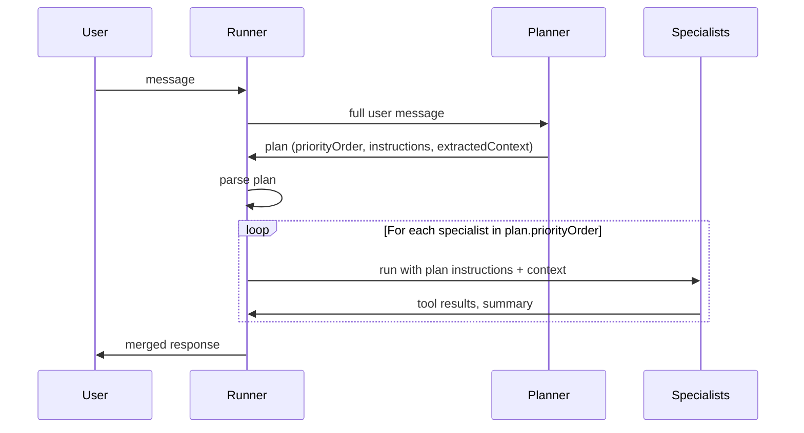
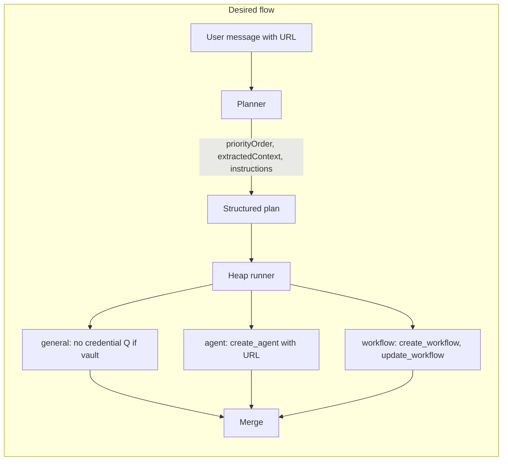

# Merged plan: Planner-first + message-queue mitigations

## Part 1 — Why we need this (root causes)

| Problem                           | Root cause                                                                                                                                                                                                                        |
| --------------------------------- | --------------------------------------------------------------------------------------------------------------------------------------------------------------------------------------------------------------------------------- |
| **Two agents**                    | Router ran `general` then parallel `[agent, improvement]`. Both have `create_agent`; same `refinedTask`; they don't see each other's results, so both create an agent.                                                            |
| **No workflow**                   | Router chose `general → [agent, improvement]` and never included **workflow**. Only the workflow specialist has `create_workflow` / `update_workflow` ([registry.ts](agentos-studio/packages/runtime/src/chat/heap/registry.ts)). |
| **URL ignored**                   | Router outputs a short `refinedTask` and dropped the concrete URL. Specialists only get `refinedTask` + "Previous steps", so they never see the URL.                                                                              |
| **Redundant credential question** | General asks "Access method — what will you provide?"; the first `ask_user` is used for `interactivePrompt`. Created agents have `std-get-vault-credential` and could ask at runtime. No coordination.                            |

**References:** [heap-runner.ts](agentos-studio/packages/runtime/src/chat/heap/heap-runner.ts), [chat route](agentos-studio/packages/ui/app/api/chat/route.ts) (heap path), [chat-helpers.ts](agentos-studio/packages/ui/app/api/_lib/chat-helpers.ts).

---

## Part 2 — Planner-first: form plan, then execute

1. **Form plan** — One LLM call: planner receives the **full user message** and outputs a structured plan: `priorityOrder`, `refinedTask`, `extractedContext` (URLs, IDs), and per-specialist instructions (`instructionsForGeneral`, `instructionsForAgent`, `instructionsForWorkflow`, etc.). No separate router.
2. **Execute plan** — Heap runner uses the plan's `priorityOrder` and, for each specialist, injects that specialist's instructions and `extractedContext` into its task/context. Specialists run in plan order.

So we align with user input (plan is derived from it), and the plan is **executed only after it is formed**.

---

## Part 3 — How the plan addresses each root cause

- **Two agents:** Planner assigns **one** creator (e.g. only `agent` in `priorityOrder` for "create one agent"; `improvement` only for "improve/fix"). Plan's `priorityOrder` avoids parallel `[agent, improvement]` for the same create intent.
- **No workflow:** Planner includes **workflow** in `priorityOrder` when the user wants schedule/run/periodic execution, and sets `instructionsForWorkflow` (e.g. create workflow and attach agent(s)).
- **URL lost:** Planner puts all URLs/IDs in `extractedContext`; runner injects `extractedContext` into each specialist's context so the URL is always available.
- **Redundant credential question:** Planner sets `instructionsForGeneral` to e.g. "Do not ask for credentials in chat; the agent will use vault at runtime. Ask only: schedule, output format, run now?" so general doesn't ask for access method when the agent will ask at run time.

---

## Part 4 — Implementation order (execute together)

### Step 1 — Planner specialist and registry

- **File:** [registry.ts](agentos-studio/packages/runtime/src/chat/heap/registry.ts)
- Add a `planner` specialist with a single tool `emit_plan` (or no tools and a strict JSON response format).
- Planner must **not** have DB tools (no create_agent, create_workflow, etc.); it only outputs the plan.
- Add `planner` to `topLevelIds` (or treat it as a special first step in the chat route, not in the DAG).

### Step 2 — Planner prompt and output shape

- **File:** New or existing prompt module under [chat](agentos-studio/packages/runtime/src/chat).
- Planner system prompt must require one JSON object with:
  - `priorityOrder`: array (specialist ids and/or `{ "parallel": ["id1","id2"] }`).
  - `refinedTask`: one short sentence.
  - `extractedContext`: object with e.g. `savedSearchUrl`, `filePaths`, or other concrete values from the user message.
  - `instructionsForGeneral`, `instructionsForAgent`, `instructionsForWorkflow` (strings; optional).
- Rules in prompt: preserve all URLs/IDs in `extractedContext`; if user wants schedule/run, include `workflow` in `priorityOrder`; if the agent will have vault/request-user-help, set `instructionsForGeneral` to not ask for credentials in chat.

### Step 3 — Chat route: planner first, then execute plan

- **File:** [chat route](agentos-studio/packages/ui/app/api/chat/route.ts)
- In the heap-mode path, **replace** the current flow (router LLM → `runHeap(priorityOrder, refinedTask, ...)`) with:
  1. Call the **planner** once with the full `effectiveMessage` (and optional rephrased prompt).
  2. Parse planner output (from `emit_plan` tool result or from assistant message) into a typed plan.
  3. Validate `priorityOrder` against the registry; fallback to e.g. `["general"]` if parse error or invalid.
  4. Call `runHeap(plan.priorityOrder, plan.refinedTask, runSpecialist, registry, { plan })` (or equivalent) so the runner receives the plan.

### Step 4 — Heap runner: inject plan into specialist context

- **Files:** [heap-runner.ts](agentos-studio/packages/runtime/src/chat/heap/heap-runner.ts), and the `runSpecialist` / `runSpecialistInner` closure in [chat route](agentos-studio/packages/ui/app/api/chat/route.ts).
- When a `plan` option is present:
  - For each specialist run, build its task/context from: `refinedTask` + "Previous steps" + **plan.instructionsFor**** (if present) + ****plan.extractedContext** (so e.g. saved-search URL is in the agent's context).
- Ensure specialists receive the full user message or at least `extractedContext` when plan is present (so URL and other concrete values are never dropped).

### Step 5 — Pass user message when no plan (fallback)

- When planner fails or is skipped, pass the original **effectiveMessage** (or user message) into each specialist alongside `refinedTask` in `runSpecialistInner` (e.g. "User message (for URLs and exact values):\n---\n{userMessage}\n---"). This covers the "URL ignored" case even without a plan.

### Step 6 — Interactive prompt: prefer "next steps" when content says so

- **File:** [chat-helpers.ts](agentos-studio/packages/ui/app/api/_lib/chat-helpers.ts) and [chat route](agentos-studio/packages/ui/app/api/chat/route.ts).
- Keep or extend the logic that uses `deriveInteractivePromptFromContentWithLLM` when display content has "Next steps" but the first `ask_user` is a different question (e.g. credential). So the user sees "Run it now / Modify / Not now" when the summary is about next steps, rather than the first credential question.

---

## Part 4b — Testing (where possible)

- **Planner output parsing (unit):** Add tests in [packages/ui/**tests**/api/_lib/heap.test.ts](agentos-studio/packages/ui/__tests__/api/_lib/heap.test.ts) for `parsePlanOutput`: valid JSON with `priorityOrder`, `refinedTask`, `extractedContext`, `instructionsForGeneral`; invalid/missing fields return null; URLs preserved in `extractedContext`.
- **Registry (unit):** Extend existing heap registry tests: after adding `planner`, expect `getRegistry().specialists.planner` to exist, have tool `emit_plan` (or no DB tools), and be in or excluded from `topLevelIds` per design.
- **Heap runner with plan (unit):** In heap.test.ts, add a test that runs the heap with a mock plan (enriched task per specialist): use a custom `runSpecialist` that records the task string; assert that when a plan is provided by the caller, the task includes instructions and extractedContext (caller passes enriched task; no runner change required) or add a test that runHeap receives options.plan and runSpecialist is invoked with enriched task (if we inject in the closure, we test the closure behavior via integration).
- **Chat route (integration):** If chat API tests exist for heap mode, add or extend one: mock planner LLM to return a valid plan JSON; assert that the response reflects one agent creation (or workflow) when plan says so. Optional: test fallback when plan parse fails (e.g. `["general"]` used).
- **Chat helpers (unit):** Existing tests in [chat-helpers.test.ts](agentos-studio/packages/ui/__tests__/api/_lib/chat-helpers.test.ts) for `getTurnStatusFromToolResults` and `deriveInteractivePromptFromContentWithLLM`; add or extend a case where content has "Next steps" and first ask_user is credential-related — assert derived prompt is used when applicable.

---

## Part 5 — Resulting flow (desired)

---

## Todos (execution checklist)

1. Add planner specialist to heap registry with `emit_plan` (or strict JSON output).
2. Define planner system prompt and parsePlanOutput; add unit tests for parsePlanOutput and registry.
3. In chat route heap path, call planner first instead of router; parse plan; run heap from plan.
4. In heap runner / runSpecialist, inject plan instructions and extractedContext per specialist.
5. Pass full user message (effectiveMessage) to planner and into specialist context when no plan.
6. Prefer "next steps" ask_user over first ask_user when content has next steps (chat-helpers/route).
7. Add/extend tests: parsePlanOutput, registry planner, heap with enriched task, chat-helpers next-steps.

