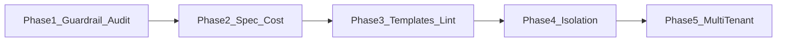

# Plan: Differentiation improvements (phased roadmap)

All six areas are addressed in priority order. Phases 1–2 deliver quick differentiation (audit, portable guardrail config, single spec). Phase 3 adds templates and lint. Phases 4–5 are larger (isolation model, multi-tenant).

---

## Phase 1 — Audit log and guardrails (user-configured only)

**Goal:** First-class audit log for tool calls; guardrails remain **user configuration** — Agentron does not enforce anything by default.

### Guardrails: user configuration only

- **Principle:** The user configures guardrails (scope, allowed/denied domains, sanitize/segment preferences, maxRequests) via existing CRUD. Agentron **does not** automatically block or sanitize requests based on guardrails. Enforcement is the user's choice.
- **Current state:** Guardrails table and tools (`create_guardrail`, `list_guardrails`, etc.) already provide configuration. No code changes required for "config only."
- **Optional later (opt-in enforcement):** If desired in a future phase, add a user-facing switch (e.g. Settings → "Enforce guardrails") or a per-guardrail `enforce: true` flag. When the user explicitly enables it, then apply URL allow/deny (and optionally sanitize) in fetch/browser paths. Until then, guardrail config is for documentation, for custom tools, or for external systems (e.g. a proxy) to consume. Not in scope for Phase 1.
- **Independently configurable:** Every guardrail dimension is a separate, optional setting. The user can configure any subset; no dimension depends on another. Schema/API/UI should treat:
  - **Scope** (deployment / workflow / agent + scopeId) — optional; defaults to deployment if omitted.
  - **URL rules** — `allowedDomains` (array), `deniedDomains` (array), or both; either can be empty or omitted.
  - **Usage limits** — `maxRequestsPerRun` (number, optional).
  - **Content handling** — `sanitize` (boolean), `segment` (boolean), `maxContentLength` (number, optional); each optional.
  - **Enforce** (when implemented) — per-guardrail or global toggle; optional.
  So: one guardrail can have only allowedDomains set; another only maxRequestsPerRun; another sanitize + segment. Implementation and UI must support partial config (no required combination).

### 1.1 Extend context with scope (for audit only)

- **ExecuteToolContext** ([packages/ui/app/api/chat/_lib/execute-tool-shared.ts](packages/ui/app/api/chat/_lib/execute-tool-shared.ts)): Add optional `auditScope?: { workflowId?: string; agentId?: string }` so the audit log can record which workflow/agent triggered the tool (no guardrail lookup).
- **Chat path:** Pass `auditScope` as empty or from conversation context if you later add "current agent" to chat.
- **Workflow path:** [packages/ui/app/api/_lib/run-workflow-tool-execution.ts](packages/ui/app/api/_lib/run-workflow-tool-execution.ts) `executeStudioTool` currently takes `runId` only. Extend signature to accept optional `workflowId` and `agentId`; pass them into `executeTool` as `auditScope` (workflowId, agentId) (or workflow when no agent). Call sites in [packages/ui/app/api/_lib/run-workflow-engine.ts](packages/ui/app/api/_lib/run-workflow-engine.ts) must supply `workflowId` and current node's `agentId` when calling the tool executor.
- *(Enforcement deferred.)* **Integration points (if opt-in enforcement added later):**
  - **Chat:** [packages/ui/app/api/chat/_lib/execute-tool-handlers-web.ts](packages/ui/app/api/chat/_lib/execute-tool-handlers-web.ts) — in `fetch_url` (and `web_search` if it hits external URLs), accept `ctx`, call `getGuardrailsForScope(ctx?.guardrailScope)`, then allow/deny URL. If browser tool is handled elsewhere in execute-tool, add same check for navigate URL.
  - **Workflow:** In `run-workflow-tool-execution.ts`, before calling `STD_IDS[toolId](input)` for `std-fetch-url`, `std-http-request`, and before `browserAutomation` for `std-browser-automation`, resolve guardrails using workflow/agent from context (you must pass context into `executeStudioTool`). Intercept `input.url` (or equivalent), apply allow/deny; optionally enforce `maxRequests` per run (e.g. per runId counter in memory or DB).
- **Sanitize/segment:** After fetching remote body, if guardrail has `sanitize` or `segment`, run a small sanitizer (strip script tags, cap length) and/or wrap in "Remote content (untrusted): …" before returning to the model. Implement in one place (e.g. runtime `fetchUrl` wrapper or in handlers) and call from both chat and workflow paths.

**Tests:** Unit tests for `getGuardrailsForScope` (deployment, agent, workflow, merge order). Integration tests: `fetch_url` / workflow std-fetch-url with guardrail scope set; expect 403 for denied URL, success for allowed. Reuse existing execute-tool and run-workflow tests; add guardrail rows and assert error/success.

### 1.2 Audit log (tool calls)

- **Schema:** New table `tool_audit_log` (id, execution_id, conversation_id, tool_id, scope_agent_id, scope_workflow_id, caller_agent_id, input_summary text, output_summary text, created_at). Optional: full input/output as text (or off by default for size). [packages/core/src/db/schema.ts](packages/core/src/db/schema.ts) and [packages/core/src/db/adapters/sqlite.ts](packages/core/src/db/adapters/sqlite.ts) SCHEMA_SQL + migrations if needed.
- **Write path:** In [packages/ui/app/api/chat/_lib/execute-tool.ts](packages/ui/app/api/chat/_lib/execute-tool.ts), after successful tool execution (and in workflow path when tools are run), insert one row: execution_id from context if workflow run, else null; conversation_id; tool name/id; scope (agent/workflow) and caller agent from context; input_summary (e.g. truncated JSON or key fields); output_summary (truncated); created_at. Keep payload size bounded (e.g. 2–4 KB per field).
- **Read path:** New API `GET /api/audit/tool-calls` (or under existing admin/diagnosis) with filters: execution_id, conversation_id, tool_id, since. Return paginated rows. Optional: document in [docs/queues-and-diagnosis.md](docs/queues-and-diagnosis.md).

**Tests:** Unit test for "tool execution writes audit row"; e2e or integration test that runs a tool and queries audit endpoint and asserts presence and key fields.

---

## Phase 2 — Single spec with policies and cost governance

**Goal:** One declarative spec (agents, workflows, tools, guardrails); optional cost caps; one-command apply.

### 2.1 Extend export/import to include guardrails

- **Export:** [packages/ui/app/api/export/route.ts](packages/ui/app/api/export/route.ts) — when type is `all` (or new type `spec`), include `guardrails`: select from `guardrails`, serialize id, scope, scope_id, config. Bump definition version or add `schema: "agentron-studio-definitions-v2"` if you want backward compatibility.
- **Import:** [packages/ui/app/api/import/route.ts](packages/ui/app/api/import/route.ts) — accept `guardrails?: Array<{ id, scope, scopeId?, config }>`. For each, insert or update by id (same skipExisting/update semantics as tools). Validate scope in `["deployment","agent","workflow"]`.

**Tests:** Export with guardrails in DB; re-import into clean DB; assert guardrails match. Import with invalid scope fails.

### 2.2 Cost caps and escalation (optional)

- **Schema:** Add to `llm_configs.extra` or new table `cost_policies`: per-llm or global `monthlyCap`, `alertAtPercent` (e.g. 80). Alternatively a single `cost_limits` table (scope deployment/agent/workflow, scope_id, monthly_cap, alert_at_percent).
- **Runtime:** When recording [token_usage](packages/core/src/db/schema.ts) (existing), aggregate by scope (e.g. deployment or agent) and period (month); if over cap, reject new LLM call with clear error; if over alert threshold, create a [notifications](packages/core/src/db/schema.ts) entry. Hook in existing LLM call path (e.g. rate-limiter or the layer that writes token_usage).
- **Docs:** Document in capabilities or a new "Governance" doc: cost caps, guardrails, audit.

**Tests:** Unit test: aggregate token_usage for scope/month; assert cap blocks call and notification created at alert.

### 2.3 One-command apply (spec-driven apply)

- **API:** `POST /api/spec/apply` — body = full export JSON (tools, agents, workflows, guardrails). Idempotent apply: for each entity, upsert by id. Option: `mode: "replace" | "merge"` (replace = delete not in spec for that type; merge = only add/update). Return counts created/updated/skipped/deleted.
- **CLI or npm script (optional):** A small script that reads a local JSON file and calls `POST /api/spec/apply` so users can run "apply this file" from CI or laptop. Document in [apps/docs](apps/docs): "Single spec, one-command environment."

**Tests:** Apply spec twice; second time no duplicate creates. Apply with replace mode; assert entities not in spec are removed (or document merge-only first).

---

## Phase 3 — Opinionated patterns: templates and lint

**Goal:** First-class workflow/agent templates; lint for agent systems (cycles, over-permissioned, unsafe tools).

### 3.1 Workflow and agent templates

- **Data:** Define 3–5 templates as JSON (e.g. "Research → Plan → Implement → Review" pipeline, "Evaluator–optimizer loop", "Orchestrator–workers"). Store in repo (e.g. `packages/ui/app/api/templates/` or `apps/docs/content/...`) or in DB table `workflow_templates` / `agent_templates` (id, name, description, workflowSnapshot or agentSnapshot JSON).
- **API:** `GET /api/templates/workflows` and `GET /api/templates/agents` return list; `POST /api/templates/apply` with templateId + optional overrides (name, model id) creates workflow/agents from snapshot (creating agents first, then workflow with resolved agent ids). Or "instantiate" endpoint that returns the JSON for the client to then POST to create_workflow/create_agent.
- **UI:** Templates entry in sidebar or "Create workflow" dropdown: "From template" → choose template → prefill graph and agents, user edits and saves.

**Tests:** Apply template; assert workflow and agents exist and edges reference correct agent ids.

### 3.2 Agent-system linter

- **Logic:** New module (e.g. `packages/runtime/src/lint/agent-system-lint.ts` or under `packages/ui/app/api/`): inputs workflow (nodes, edges) + list of agents (with toolIds). (1) **Cycles:** Build graph from workflow edges; detect cycles (e.g. DFS). (2) **Over-permissioned:** Optional rule: agents with > N tools (e.g. 10) warn. (3) **Unsafe tools:** Optional allow-list of "sensitive" tool ids (e.g. std-get-vault-credential, run_container); report if workflow uses an agent that has such tools without a designated "trusted" role (could be a tag on agent later). Return `{ errors: [], warnings: [] }`.
- **API:** `POST /api/lint/workflow` body `{ workflowId }` or `{ workflow, agents }`; return lint result. Call from UI before save or on "Validate" button.
- **Docs:** Add "Linting agent systems" to [apps/docs/content/concepts](apps/docs/content/concepts) and reference in workflows.mdx.

**Tests:** Unit tests: workflow with cycle → error; workflow with 12-tool agent → warning; workflow with vault tool → warning if no "trusted" flag (when implemented).

---

## Phase 4 — First-class isolation

**Goal:** Configurable isolation per agent (or per workflow): optional dedicated sandbox, fs root, trust tier.

### 4.1 Isolation model in schema and types

- **Schema:** Add to agents table (or new `agent_isolation` table): `isolationLevel: text` (e.g. `none | shared_runner | dedicated_sandbox | strict`), `sandboxId: text` (optional, for dedicated_sandbox), `fsRoot: text` (optional path), `trustTier: text` (e.g. `untrusted | semi_trusted | trusted`). If new table: agent_id, isolation_level, sandbox_id, fs_root, trust_tier. [packages/core/src/db/schema.ts](packages/core/src/db/schema.ts) and SQLite adapter.
- **Types:** [contracts/shared-types.md](contracts/shared-types.md) and [packages/core/src/types/agent.ts](packages/core/src/types/agent.ts): extend Agent or add IsolationConfig: isolationLevel, sandboxId?, fsRoot?, trustTier?.

### 4.2 Runtime behavior

- **Dedicated sandbox:** When `isolationLevel === "dedicated_sandbox"` and `sandboxId` is set, use that sandbox for all code execution for that agent (run_code, custom functions invoked by that agent). If not set, create one sandbox per agent on first use (or on agent save) and store in agent record. Reuse [ensureRunnerSandboxId](packages/ui/app/api/chat/_lib/execute-tool-shared.ts) pattern but keyed by agent id.
- **fsRoot:** When running code in a sandbox for an agent with fsRoot, use container volume mount or exec with `chdir` to that path; reject paths outside fsRoot (validate in run_code/custom-function path). Requires Podman/container support for mount or working directory.
- **Trust tier:** Map to capabilities: e.g. untrusted = no vault, no run_container; semi_trusted = vault allowed with approval; trusted = full. In execute-tool and run-workflow-tool-execution, before invoking sensitive tools, check agent's trustTier and allow/deny. Start with a simple allow-list of tool ids per tier in config.

**Tests:** Agent with dedicated_sandbox gets own container; agent with untrusted cannot call std-get-vault-credential (mock or integration). Optional: fsRoot validation rejects path escape.

### 4.3 Export/import and docs

- Include `isolationLevel`, `sandboxId`, `fsRoot`, `trustTier` in agent export/import. Document in [apps/docs/content/concepts/agents.mdx](apps/docs/content/concepts/agents.mdx): "Isolation and trust tiers."

---

## Phase 5 — Multi-tenant design

**Goal:** Users and tenants (or orgs) as first-class; per-tenant data boundaries; tenants can define agents under constraints.

### 5.1 Data model

- **Schema:** New tables: `tenants` (id, name, slug, created_at), `users` (id, tenant_id, email_or_id, role, created_at), optional `projects` (id, tenant_id, name). Add `tenant_id` to: agents, workflows, tools, conversations, executions, guardrails, token_usage, feedback, run_logs, etc. (Large but mechanical; do in a migration.)
- **Indexes:** All list/read queries filter by tenant_id (and optionally project_id). Enforce in API layer: resolve tenant from auth (API key, session, or header) and scope all reads/writes to that tenant.

### 5.2 API and auth

- **Auth:** Introduce minimal auth: e.g. API key per tenant (`tenant_api_keys`: tenant_id, key_hash, name) or session after login. For desktop/single-user, default tenant "default" with one user. All existing APIs assume "current tenant" from context.
- **Scoping:** Every route that reads/writes agents, workflows, tools, runs, etc., must resolve tenant (and optionally project) and add to WHERE. New routes: `GET/POST /api/tenants`, `GET/POST /api/users` (admin or self), optional `GET/POST /api/projects`.
- **Constraints:** Per-tenant limits (max agents, max workflows, max runs per day) in config or tenant row; enforce on create. "Tenants define their own agents under constraints" = same create_agent/create_workflow but scoped to tenant and subject to limits.

### 5.3 Export/import and docs

- Export scoped to tenant (only that tenant's entities). Import accepts tenant_id or creates in current tenant. Document multi-tenant in [docs/architecture.md](docs/architecture.md) and a new "Multi-tenancy" concept page.

**Tests:** Create two tenants; create agent in tenant A; list agents as tenant B returns empty. Enforce limit: tenant at max agents cannot create more.

---

## Dependency overview

Phase 2 depends on Phase 1 (audit log and guardrails in spec). Phase 3 is independent but benefits from a stable spec. Phase 4 (isolation) can be done before or after Phase 3. Phase 5 (multi-tenant) should follow Phase 4 so isolation and tenant boundaries align.

---

## Implementation order summary

| Phase | Focus                        | Key deliverables                                                                                                                   |
| ----- | ---------------------------- | ---------------------------------------------------------------------------------------------------------------------------------- |
| 1     | Audit + guardrails as config | auditScope in context (for audit only); tool_audit_log table and write/read API; guardrails remain user-configured, no enforcement |
| 2     | Single spec + cost           | Guardrails in export/import; cost_policies/caps and notification; POST /api/spec/apply                                             |
| 3     | Templates + lint             | Workflow/agent templates API and UI; lint module (cycles, over-permission, unsafe tools) and POST /api/lint/workflow               |
| 4     | Isolation                    | Agent isolation fields, dedicated sandbox per agent, fsRoot and trustTier enforcement                                              |
| 5     | Multi-tenant                 | tenants/users tables, tenant_id on entities, auth and scoped APIs                                                                  |

---

## Test strategy per phase

- **Phase 1:** Unit: audit scope passed correctly. Integration: tool execution writes audit row; GET /api/audit/tool-calls returns rows. No guardrail enforcement tests.
- **Phase 2:** Unit: export/import with guardrails; cost aggregate and cap. Integration: spec/apply idempotency.
- **Phase 3:** Unit: cycle detection, permission count, unsafe-tool check. Integration: template apply creates workflow/agents.
- **Phase 4:** Unit: trust tier blocks tool. Integration: dedicated sandbox used for agent's code run.
- **Phase 5:** Integration: tenant-scoped list/create; limit enforcement; export/import per tenant.

All new code should follow existing patterns (DB via [packages/ui/app/api/_lib/db.ts](packages/ui/app/api/_lib/db.ts), tools in execute-tool.ts, docs in apps/docs). Run `pnpm run ci:local` before considering each phase complete.
