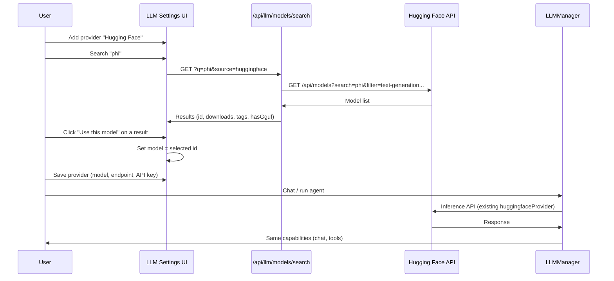

# Hugging Face integration: search and install via UI

## Goals

- **Search**: User can search Hugging Face for models from the app (LLM settings and, where relevant, agent config).
- **Install / use**:
  - **Use via HF Inference API**: User selects a model from search → save as an LLM provider → use for chat/agents (no local install).
  - **Install locally (Ollama)**: User searches HF → picks a model with GGUF → import into Ollama (existing flow on Local Models page).
- **No curated SLM list**: All discovery is via search; no static catalog of small LLMs.

---

## Current state

| Piece | Location | Notes |
| ----- | -------- | ----- |
| **HF provider (Inference API)** | [packages/core/src/types/llm.ts](packages/core/src/types/llm.ts), [packages/runtime/src/llm/providers/huggingface.ts](packages/runtime/src/llm/providers/huggingface.ts) | Already supports `provider: "huggingface"` + model id; OpenAI-compatible endpoint. |
| **HF model search API** | [packages/ui/app/api/llm/models/search/route.ts](packages/ui/app/api/llm/models/search/route.ts) | `GET ?q=...&source=huggingface` → calls `huggingface.co/api/models?search=...&filter=text-generation&sort=downloads&limit=20`. Returns `id`, `downloads`, `likes`, `tags`, `hasGguf`. |
| **HF search in UI** | [packages/ui/app/settings/local/page.tsx](packages/ui/app/settings/local/page.tsx) | Only on **Local Models** page: search HF → "Import" sets pull model to `hf.co/${id}` for Ollama. |
| **Import to Ollama** | [packages/ui/app/api/llm/models/import/route.ts](packages/ui/app/api/llm/models/import/route.ts) | `POST { model, source: "huggingface" }` → `ollama pull hf.co/${model}`. |
| **LLM Settings** | [packages/ui/app/settings/llm/page.tsx](packages/ui/app/settings/llm/page.tsx) | Add provider: when provider is `huggingface`, model is free-text only (no search UI here yet). |
| **Agent LLM** | [packages/ui/app/agents/[id]/llm-settings.tsx](packages/ui/app/agents/[id]/llm-settings.tsx) | Hugging Face not in provider list; model is manual input. |

---

## Integration map

### 1. LLM Settings: Hugging Face = search, then save provider

**File**: [packages/ui/app/settings/llm/page.tsx](packages/ui/app/settings/llm/page.tsx)

- When user adds or edits a provider and selects **Hugging Face**:
  - **Model field**: Do not use a static catalog. Instead:
    - Show a **“Search Hugging Face”** block: search input + button calling `GET /api/llm/models/search?q=...&source=huggingface`.
    - Render results (model id, downloads, tags, `hasGguf` badge).
    - On “Use this model” (or row click), set the form’s **model** value to the selected HF model id (e.g. `microsoft/phi-2`).
  - User saves the provider as usual; stored config = `provider: "huggingface"`, `model: "<id>"`, endpoint (default Inference API), API key.
- No curated list: catalog remains empty for `huggingface`; discovery is search-only.

**Result**: User can add a Hugging Face provider entirely from search → select → save, and use it for chat/agents.

### 2. Agent LLM: Hugging Face + search

**File**: [packages/ui/app/agents/[id]/llm-settings.tsx](packages/ui/app/agents/[id]/llm-settings.tsx)

- Add **Hugging Face** to the provider dropdown: `{ value: "huggingface", label: "Hugging Face" }`.
- When provider is `huggingface`:
  - Either:
    - **Option A**: Free-text model input with placeholder `organization/model-name` (e.g. `microsoft/phi-2`), or
    - **Option B**: Same “Search Hugging Face” pattern as in LLM Settings (search → results → “Use this model” sets model).
- No catalog dependency; search-only for discovery.

**Result**: Agents can use Hugging Face via saved providers or by manual provider + model (with optional search in UI).

### 3. Search API (optional tweaks)

**File**: [packages/ui/app/api/llm/models/search/route.ts](packages/ui/app/api/llm/models/search/route.ts)

- Keep current behavior; optionally add query params to narrow results, e.g.:
  - `pipeline=text-generation-inference` or `filter=...` passed to Hugging Face API.
  - `limit` to request more than 20 if needed.
- No change required for basic “search and install/use” flow.

### 4. Install to Ollama (existing; document in one place)

- **Search**: Already on [packages/ui/app/settings/local/page.tsx](packages/ui/app/settings/local/page.tsx) — “Import from HuggingFace” uses the same search API.
- **Install**: User picks a result with GGUF → “Import” sets pull model; pull uses [packages/ui/app/api/ollama/pull](packages/ui/app/api/ollama/) or the import API. [packages/ui/app/api/llm/models/import/route.ts](packages/ui/app/api/llm/models/import/route.ts) supports `POST { model, source: "huggingface" }` → `ollama pull hf.co/${model}`.
- Optionally, from **Settings → LLM** add a short link: “Install a model locally (Ollama)” → navigates to the Local Models page (where HF search + import already live). Not required for “integrate HF”; just improves discoverability.

**Result**: One clear path: **use** HF via Inference API (LLM Settings + Agent) and **install** HF models to Ollama (Local Models page). No curated list; user searches in both flows.

### 5. No curated Hugging Face catalog

- Leave [packages/runtime/src/llm/models/catalog.ts](packages/runtime/src/llm/models/catalog.ts) with `huggingface: []`.
- Do not add a static list of small or other models; the user discovers everything via search.

---

## Data flow

**Install to Ollama** (unchanged):

- User goes to **Local Models** → “Import from HuggingFace” → search → Import (GGUF) → Ollama pull. Same search API; install via existing import/pull flow.

---

## Summary

| Area | Action |
| ----- | ----- |
| **LLM Settings** | For provider Hugging Face: add “Search Hugging Face” (reuse search API); on select, set model id and save provider. No catalog. |
| **Agent LLM** | Add Hugging Face to provider list; model = free-text or same search UI. No catalog. |
| **Search API** | Keep as-is; optional extra query params for HF API. |
| **Install to Ollama** | Leave on Local Models page; optionally link from LLM Settings. |
| **Catalog** | Do not curate; keep `huggingface: []`. Discovery = search only. |

Inference and tools stay unchanged: existing `huggingface` provider and config already support any HF model id; this plan only adds search-driven discovery and a clear path to add/use HF models and to install them locally via the existing Ollama flow.
