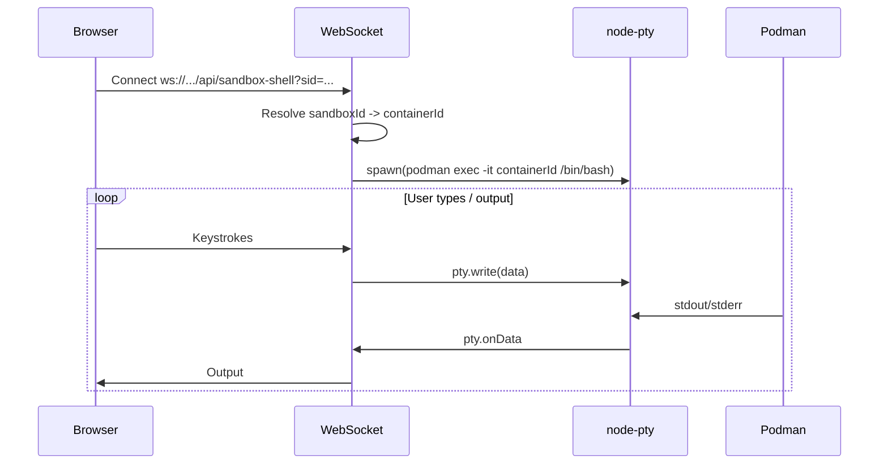

# Interactive sandbox shell component

Plan for implementing a real interactive terminal attached to a sandbox container (PTY + WebSocket + xterm.js). Auth is out of scope for this iteration; a short "Later" section describes optional app unlock for remote access.

---

## Architecture

- **Backend:** WebSocket endpoint that resolves `sandboxId` → container, spawns `podman exec -it <containerId> /bin/bash` (or `/bin/sh`) inside a **PTY** (node-pty), and bridges PTY stdin/stdout to WebSocket messages. Optional resize (cols/rows) so full-screen apps work.
- **Frontend:** React component using **@xterm/xterm** that connects to the WebSocket, sends keystrokes, renders output, handles resize.
- **Entry points:** New sandboxes list page (`/sandboxes`) with "Open terminal" per sandbox; optionally "Open terminal" from chat when a sandbox is created.

---

## 1. Backend: WebSocket + PTY bridge

**Constraint:** Next.js App Router does not support WebSocket in API routes natively. Use **next-ws** to add an `UPGRADE` handler in a route (e.g. `app/api/sandbox-shell/route.ts`). Keeps everything in the Next process; works for Node (not serverless).

**Handler logic:**

1. **Query param:** Accept `sandboxId` (or `sid`) on the WebSocket URL. Validate and load sandbox from DB (reuse existing db + container-manager).
2. **Resolve container:** Ensure sandbox has `containerId` and `status === "running"`. If not, send an error frame and close the socket.
3. **Spawn with PTY:** Use **node-pty** to spawn the container engine (podman or docker from settings) with `exec -it <containerId> /bin/bash` (fallback `/bin/sh`). Resolve engine path (e.g. `where.exe podman` on Windows or PATH).
4. **Bridge:**  
   - `pty.onData(data)` → send to WebSocket (e.g. `{ type: 'out', data }` or raw).  
   - WebSocket `on('message', buf)` → `pty.write(buf)`.  
   - On `pty.onExit` or WebSocket close → kill PTY and close the other side.
5. **Resize:** Accept messages like `{ type: 'resize', cols, rows }` and call `pty.resize(cols, rows)`.

**Dependencies:** Add `node-pty` and `next-ws`. node-pty has native bindings (document build tools on Windows if needed).

**Files:** New `packages/ui/app/api/sandbox-shell/route.ts` (with `UPGRADE` for next-ws). Reuse DB helpers and container engine config.

---

## 2. Frontend: Terminal component

- **Library:** **@xterm/xterm** and **@xterm/addon-fit** (responsive resize). Use a ref + `useEffect` to create/dispose the Terminal.
- **Responsibilities:** One `
` for xterm; connect WebSocket (`/api/sandbox-shell?sid=${sandboxId}`); `term.onData` → send to WS; WS `message` → `term.write(data)`; handle resize (addon-fit or manual + send resize to server); on unmount or WS close, close socket and dispose terminal; show "Disconnected" when socket closes unexpectedly.
- **Placement:** Reusable `packages/ui/app/components/sandbox-terminal.tsx` taking `sandboxId` (and optional `sandboxName` for title). Import `xterm.css`.

**Files:** New `packages/ui/app/components/sandbox-terminal.tsx`.

---

## 3. UI entry points

- **Sandbox list page:** New `app/sandboxes/page.tsx` — GET `/api/sandbox`, list sandboxes, "Open terminal" per running sandbox (navigate to `/sandboxes/[id]` or open terminal in modal).
- **Sandbox shell page:** New `app/sandboxes/[id]/page.tsx` — full-page `SandboxTerminal` for that `sandboxId` (or single list page with terminal in modal).
- **Chat (optional):** When a tool result includes a created sandbox (`create_sandbox` returns `id`), show "Open terminal" that opens the terminal component with that id.

**Files:** New `app/sandboxes/page.tsx`, `app/sandboxes/[id]/page.tsx`. Optionally extend chat message/tool-result UI for "Open terminal".

---

## 4. Dependencies

| Package         | Purpose                |
|-----------------|------------------------|
| node-pty        | PTY for interactive exec |
| next-ws         | WebSocket in Next.js   |
| @xterm/xterm    | Browser terminal       |
| @xterm/addon-fit| Resize terminal        |

(`ws` is already in the project.)

---

## 5. Implementation order

1. **Backend:** Add node-pty and next-ws. Implement WebSocket handler: resolve sandbox → container, spawn `podman exec -it` in PTY, bridge PTY ↔ WebSocket (+ optional resize).
2. **Frontend:** Add @xterm/xterm and `SandboxTerminal` component; connect to WebSocket; wire input/output and resize.
3. **Entry points:** Add sandboxes list page and sandbox shell page (or modal); optionally "Open terminal" from chat.
4. **Polish:** Reconnection hint, "Disconnected" state, clear errors; document Windows/engine requirements.

---

## Later: optional app unlock (auth) for remote access

When you want to secure the app for remote access, you can add app-level auth in a follow-up iteration. The approach (reuse vault as app lock, `AGENTRON_REQUIRE_AUTH=1`, middleware, `/login` page, and WebSocket cookie check) is described in the git history of this file or can be re-derived from the vault and cookie flow already in the codebase. The shell component will work without any auth until then.
